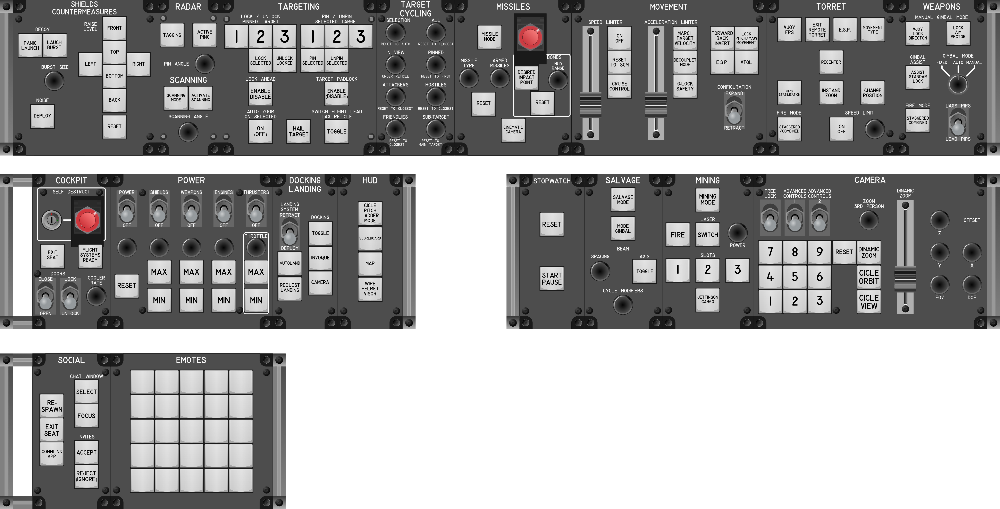
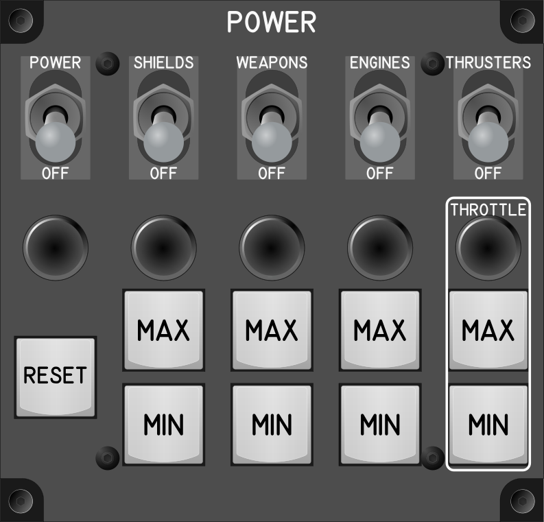
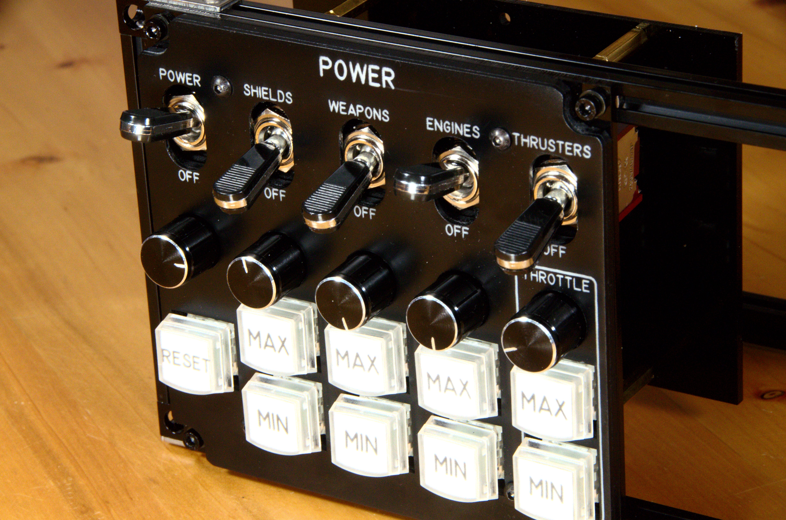
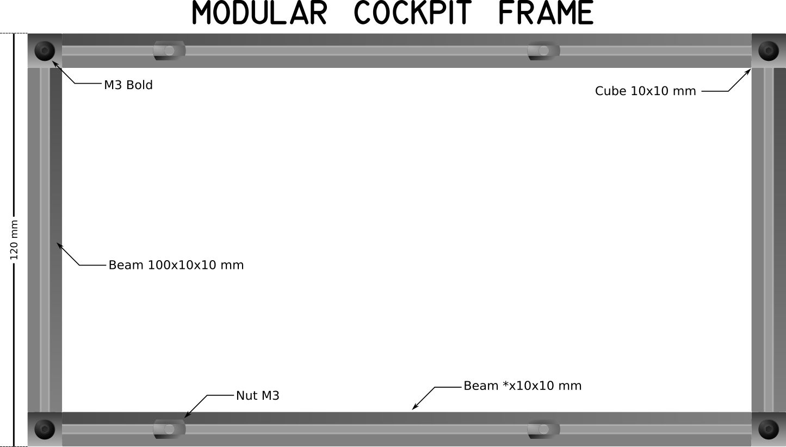

# Modular Cockpit para Star Citizen

El `Modular Cockpit` es un sistema de controles físicos para *Star Citizen*. 



Se compone de `Modules` que agrupan varios controles físicos interrelacionados como *switchs*, *potenciómetros*, *encoders*, etc. Por ejemplo el `Power Module` tiene varios *toggle switch* para activar o desactivar la potencias de las armas, escudos u otros; también tiene *encoders* que sirven aumentar y disminuir la potencia, además de botones para poner rápidamente potencia máxima o mínima.






Éstos `Modules` pueden conectarse directamente al puerto USB del computador y el sistema operativo los ve como un joystick, por lo que es fácil hacer el *keybinding* en *Star Citizen* .

También se pueden `acoplar` varios `Modules`  a un `Control Panel` y este a su vez conectarse a un puerto USB del computador. Cuando se acoplan varios `Modules`  a un `Control Panel` todos estos los ve el computador como un sólo joystick. Esto es muy conveniente cuando se tiene una gran cantidad de `Modules` conectados lo que hace que el sistema operativo no tenga fallas en el reconocimiento y operación de estos múltiples joysticks.

Los `Modules` son intercambiables, esto es, de pueden cambiar de `Control Panel`  o de posición en él. De esta forma el jugador puede configurar fácilmente su cockpit dependiendo de su estilo de juego.

También, y muy importante, el `Modular Cockpit` es un proyecto de hardware libre y software libre. Esto quiere decir que cualquier persona puede bajar los diseños y firmware, y construir su propio cockpit. Pero también lo puede usar para lo que quiera. Además es libre de estudiar como está hecho el `Modular Cockpit` y si quiere modificarlo a sus necesidades. Y finalmente tiene la libertad de redistribuirlo con o sin estos cambios siempre y cuando diga de donde lo sacó y quienes son sus autores.

## Motivaciones

1. [Star Citizen](https://robertsspaceindustries.com/star-citizen/) es un juego con una funcionalidad e interactividad muy enriquecidas.
1. Cada nave en *Star Citizen* puede desempeñar uno o varios roles.
1. Cada jugador en *Star Citizen* puede jugar uno o varios roles.
1. Cada rol tiene una forma particular de interactividad.
1. Cada jugador tiene una forma distinta de jugar.

Por lo tanto cada jugador necesita un cockpit único adaptado a su forma de jugar. Se necesita un cockpit para *Star Citizen* modular, abierto y adaptable.

### Definiciones

<dl>

<dt> Pilot:</dt>
<dd>El usuario del <i>Modular Cockpit</i>, la razón de ser de él.</dd>

<dt>Componente:<dt>
<dd>Son los átomos que componen el <i>Modular Cockpit</i>, pueden ser componente electrónicos, como: switches, potenciómetros, cables, diodos, microcontroladores o mecánicos: como láminas de acrílico, makerbeams, etc.</dd>

<dt>Control físico:<dt>
<dd>Es un tipo de <i>Componente</i> eléctrónico mediante el cual el <i>Piloto</i> hace una interacción con <i>Star Citizen</i>. Por ejemplo switches, buttoms, encoders, potenciómetros, etc.</dd>

<dt>Module:</dt>
<dd>Es una agrupación de controles físicos y componentes con funciones relacionadas. </dd>

<dt>Control Panel</dt>
<dd>Es una estructura hecha con <a href="https://www.makerbeam.com/makerbeam/">Makerbeam de 10x10 mm</a>(Ver <i>Frame</i>) en donde se pueden <i>acoplar</i> uno o varios <i>Modules</i>. </dt>

<dt>Frame:<dt>
<dd>Este es una estructura creada con <a href="https://www.makerbeam.com/makerbeam/">Makerbeam de 10x10 mm</a>. Tiene una altura de 120 mm y el ancho que se necesario. Para ello se usa <a href="https://www.makerbeam.com/makerbeam-100mm-16p-black-makerbeam.html"><i>Beams</i> verticales de 100 mm</a> de largo y se unen a los <a href="https://www.makerbeam.com/makerbeam/10x10mm-profiles-black/"><i>Beams</i> horizontales</a> con <a href="https://www.makerbeam.com/makerbeam-corner-cubes-12p-black-for-makerbeam.html">MakerBeam Corner Cube</a>. En los <i>Beams</i> horizontales se introducen varios <a href="https://www.makerbeam.com/makerbeam-t-slot-nuts-for-makerbeam-25p.html">T-slot nuts</a>, que es donde se atornillan los <i>Modules</i> con pernos M3. Se puede usar cualquier otro sistema compatible. Por ejemplo la siguiente imagen se muestra un <i>Frame</i> de 220 mm. de ancho con sus distintas partes.</dd>

<dt>Acoplar un Módulo</dt>
<dd>Colocar físicamente un <i>Módulo</i> en un <i>Control Panel</i> y que quede fijado y conectado.</dd>

<dt>Desacoplar un Módulo</dt>
<dd>Retirar un Módulo del Control Panel, quedando libre la ranura.</dd>

</dl>



## Requerimientos de diseño

### Requerimiento de diseño de los `Module`

1. Cada `Module` debe funcionar independientemente: para funcionar no debe necesitar de otros módulos u otros elementos, con excepción del computador.
1. Debe ser intercambiable, esto es, se puede poner en cualquier `ControlPanel` y funcionar.
1. Un modulo debe tener un sólo cable conectado a él, el cable de USB.
1. Un `Module` debe ser atornillable al `Frame` de un `ControlPanel.
1. Un módulo agrupa varias funciones relacionadas. La agrupación de estas funciones debe seguir la categorización dada en el *Keybinding*  de * Star Citizen*. Por ejemplo hay una categoría de *Vehicles - Cockpit* entonces se tendrá al menos un módulo que cubra esa categoría.
1. La estética de los `Module` debe ser similar a los de los aviones militares. Ver [The Warthod Proyect](https://thewarthogproject.com/) como referencia.
1. La funciones particulares, como el backlighting, deben funcionar en el `Module`, si no se tiene un control particular para esta función se debe poder controlar desde el computador o desde un `Control Panel` independientemente. 

### Requerimiento de diseño de los control panel

1. La parte frontal de un `ControlPanel` es un `Frame` como se definió en 
1. Cada `ControlPanel` debe tener sólo dos cables conectados a él: el cable USB y el cable de alimentación.
1. Los `Modules` conectados al `Control Panel` el computador los debe ver como si fueran un sólo joystick. Esto por los errores y problemas que surgen al conectar mucho joystick simultaneas.
1. Un `Control Panel` puede centralizar funciones particulares de un `Module`, como el backlighting, para hacer cambios globales de estas funciones.
1. Un `Control Panel` controla la función de ventilación, que los `Modules` no manejan.


## Módulos

1. [Salvage Module](modules/SalvageModule)
1. [Missiles Module](modules/MissilesModule)
1. [Docking and Landing Module](modules/DockingLandingModule)
1. [Shields and Countermeasures Module](modules/ShieldsCountermeasuresModule)
1. [Emotes Module](modules/EmotesModule)
1. [Movement Module](modules/MovementModule)
1. [Weapons Module](modules/WeaponsModule)
1. [Target Cycling Module](modules/TargetCyclingModule)
1. [Camera Module](modules/CameraModule)
1. [Stopwatch Module](modules/StopwatchModule)
1. [Power Module](modules/PowerModule)
1. [Targeting Module](modules/TargetingModule)
1. [Social Module](modules/SocialModule)
1. [Torret Module](modules/TorretModule)
1. [Mining Module](modules/MiningModule)
1. [Cockpit Module](modules/CockpitModule)
1. [Radar and Scanning Module](modules/RadarScanningModule)
1. [Hud Module](modules/HudModule)

## Dispositivos de entrada

Se tienen varios tipos de dispositivos de entrada:

<dl>

<dt>Teclas de teclado mecánico:</dt>
<dd>Las teclas de teclado mecánico se usan para la mayoría de los keybindings de SC, esto es por que SC esta diseñado usando teclas. /<dd>

<dt>Encoder</dt>
<dd>Para los casos que se tienen dos teclas en la que una es de incrementar y otra de decrementar cambiando una misma cantidad, por ejemplo incrementar o decrementar la energía de los escudos.<dd>

<dt>Toggle Switch (ON/OFF)</dt>
<dd>Estos se usan cuando se tienen dos teclas, una de prender y otra de apagar,por ejemplo prender y apagar escudos.<?dd>

<dt>Potenciómetro líneal</dt>
<dd>Estos sirven para aquellos casos en los que SC tiene asociados ejes (axis), o cambios absolutos de una cantidad.</dd>

<dt>Joystick</dt>
<dd>Aparte de los casos obvios en el cual se usan los joystick hay keybinding que por su naturaleza deberían controlarse con joystick. Un joystick en realidad son (por lo menos) dos potenciómetros ortogonales por lo que pueden controlar dos variables absolutas ortogonales, como el caso del desplazamiento z/y de la cámara.</dd>

<dt><a href="https://www.cirque.com/glidepoint-circle-trackpads">GlidePoint® Circle Trackpads<a> (el del Steam Controler)</dt>
<dd>Este trackpad funciona muy parecido a un joystick análogo por lo que puede usarse en lo mismo.</dt>

</dl>

## Microcontrolador

Se usa *[Teensy®](https://www.pjrc.com/teensy/)* por las siguientes razones:

1. Funciona como varios dispositivos HID a la vez, puede ser teclado, joystick y mouse al mismo tiempo, además de funcionar con serial. Esto último es necesario para implementar un protocolo de comunicaciones con los módulos o en el caso de que * *Star Citizen* * implemente algo parecido al * *DCS-BIOS* *. El poder tener teclado y joystick a la vez es necesario, por ejemplo, para el ```CameraModule```, puesto que * *Star Citizen* * no tiene forma de mapear teclas de joystick para las funciones avanzadas de la cámara y éstas están sólo pueden ser mapeadas en teclado y mouse.
1. Tiene muchos pines de entrada. En el caso del *Teensy 4.0* se tienen 40 pines 
digitales y 14 análogos. En el *Teensy 4.1* de tienen 55 entradas digitales y
18 análogas. Esto es necesario puesto que hay módulos que requieren muchas 
entradas como el `TargetCiclingModule` con 24 entradas digitales. 
El `PowerModule` con 30 entradas digitales.
1. Además todas la entradas digitales tienen capacidad de interupción. Esto
hace que la lectura de entradas se haga mucho más rápido. Por ejemplo el `TargetCyclingModule` que tiene muchos encoders en mucho más rápido con la capacidad de interupción.
1. También se tiene muchas salidas PWM. En el caso del *Teensy 4.0* se tienen 31. En el caso del * Teensy 4.1* se tienen 35. Esto es muy importante para el manejo de la retroluminación de los módulos.
1. El *Tennsy 4.1* tiene un puerto *USB Host* que se usa en los `Control Panel` para unificar a los `Modules` y que el sistema operativo lo vea como un sólo joystick.
1. Tiene muy buena velocidad, lo cual para el *Teensy 4.1* que se usa para unificar los módulos en el `ControlPanel` sea preferible.
1. También tiene buena cantidad de memoria, lo que hace que eso no se una preocupación a la hora de hacer el código.


## Referencias

### Componentes

#### Microcontrodores

##### Teensy

1. [Teensy® 4.1 Development Board](https://www.pjrc.com/store/teensy41.html)
1. [Teensy® 4.0 Development Board](https://www.pjrc.com/store/teensy40.html)

###### Teensy con  Arduino

Para trabajar con el IDE de Arduino se necesitan al menos tres partes:

1. [Teensyduino](https://www.pjrc.com/teensy/teensyduino.html) La extensión del IDE de Arduino para Teensy.
1. [Using USB Keyboard](https://www.pjrc.com/teensy/td_keyboard.html) Libraría para simular un teclado con Teensy.
   1. [Using USB Joystick](https://www.pjrc.com/teensy/td_joystick.html)
       Librería para sinular un joystick con Teensy.
   1. [Keypad Library](https://www.pjrc.com/teensy/td_libs_Keypad.html) Librería para leer una matriz de teclas.
   1. [Encoder Library](https://www.pjrc.com/teensy/td_libs_Encoder.html) Libreria para leer los encoders.

##### Encoders

1. [Rotary Encoder - Illuminated (RGB)](https://www.sparkfun.com/products/15141)
   Un encoder 24 pasos y RGB de Sparkfun.
   1. [Clear Plastic Knob](https://www.sparkfun.com/products/10597) Otra perilla
      para el encoder, pero transparente. Esta sería mejor para el encoder que tiene RGB.
1. [AliExpress: 100 step encoder](https://www.aliexpress.com/w/wholesale-100-step-encoder.html) Encoders de 100 pasos en Aliexpress.
1. [Amazon: 5V 60MM Ultra-Thin Hand Wheel Pulse Encode](https://www.amazon.com/Terminal-Aviation-Aluminum-Positions-Electronic/dp/B07Q75KT49/ref=sr_1_4?crid=2X4LKS9I1QZKQ)
1. [Amazon: Busqueda cnc rotary encoder](https://www.amazon.com/s?k=cnc+rotary+encoder)
   Un Encoder de 100 pasos como los de Aliexpress pero en Amazon.
   1. [100PPR 6 Terminal Electronic Hand Wheel Manual Pulse Encoder for CNC System (Black)](https://www.amazon.com/100PPR-Terminal-Electronic-Manual-Encoder/dp/B07G9FVHM8)
      Otro encoder de 100 pasos mejor documentado.    

###### Los encoders con Arduino

1. [Arduino - Rotary encoder Simple Example KY-040](https://create.arduino.cc/projecthub/vandenbrande/arduino-rotary-encoder-simple-example-ky-040-b78752)

###### Los encoders con QMK

1. [Encoders: Documentación de QMK](https://github.com/qmk/qmk_firmware/blob/master/docs/feature_encoders.md)
  Parece estar muy bien exlicado, supone que se sabe que son las líneas A y B.
1. [How can I use a rotary encoder?](https://docs.splitkb.com/hc/en-us/articles/360010513760-How-can-I-use-a-rotary-encoder-)
  Explica como usar un _rotaty encoder_ wn QMK con eejemplo específicos como control de audio, scrolling, moviemiento de ventanas, tabbing, etc.
1. [QMK Encoder Setup](https://www.youtube.com/watch?v=GLqSPa_Zc2Q) Explica como configurar un escoder de cien pasos (de los que se consiguen en Aliexpress)
1. [Hub16 Encoder Configuration](https://www.youtube.com/watch?v=TTCaQ-STD-E) Como configurar dos encoder con QMK y los codigos de teclado de QMK.
1. [Using multiple encoders in QMK by wiring them up to your matrix rows](https://www.youtube.com/watch?v=DyHxccSvsPs) Explica como conectar varios encoders.

### Imagenes

* [xkeys: Printable Legend Templates](https://xkeys.com/usbcustomkeyboards/customprintedlegends.html#LegendTemplates)
  Una plantilla para imprimir las etiquetas de la teclas de xkeys.
  Archivo local: [SingleKeyLegendTemplate.pdf](images/xkeys/SingleKeyLegendTemplate.pdf)

### openclipart

* Toggle Switch (On/OFF) Plástico Negro
  * [Switch On](https://www.openclipart.org/detail/180085/switch-on)
    Switch On/Off, en posición ON, plástico negro.
    Nombre archivo local: [ToggleSwitch_ON-OFF_PlasticoNegro-On.svg](images/openclipart/ToggleSwitch_ON-OFF_PlasticoNegro-On.svg)
  * [switch on/off](https://www.openclipart.org/detail/62737/switch-onoff)  
    Switch On/Off, en posición OFF , plástico negro.
    Archivo local: [ToggleSwitch_ON-OFF_PlasticoNegro-Off.svg](images/openclipart/ToggleSwitch_ON-OFF_PlasticoNegro-Off.svg)
* [Faders from mixing board](https://www.openclipart.org/detail/201691/faders-from-mixing-board)
  Petenciometro líneal.
  Archivo local: [faders.svg](images/openclipart/faders.svg)
* [metallic shine](https://www.openclipart.org/detail/307289/metallic-shine)
  Lo que parece ser un knob metálico.
  Archivo local: [metallic-shine.svg](images/openclipart/metallic-shine.svg)
* [Joystick](https://www.openclipart.org/detail/246396/joystick)
  Un joystick pequeño y muy esquemático.
  Archivo local: [JoyStick.svg](images/openclipart/JoyStick.svg)
* [DPST micro push button switch](https://www.openclipart.org/detail/299643/dpst-micro-push-button-switch)
  Un switch pequeño como para protoboard.
  Archivo local: [JoyStick.svg](images/openclipart/JoyStick.svg)
* [Blank Generic Keyboard](https://www.openclipart.org/detail/177279/blank-generic-keyboard)
  Teclado en blanco.
  Archivo local: [Blank-Generic-Keyboard-Remix-by-Merlin2525.svg](images/openclipart/Blank-Generic-Keyboard-Remix-by-Merlin2525.svg)
* [Non-linear video editing system 1](https://www.openclipart.org/detail/284960/nonlinear-video-editing-system-1)
  Una consola de edición no lineal de vídeo.
  Se pueden sacar de aquí los knobs y otros openclipart de dispositivos.
  Archivo local: [Non-linear video editing system 1.svg](images/openclipart/Non-linear video editing system 1.svg)
* [Industrial Toggle Switch](https://www.openclipart.org/detail/246398/industrial-toggle-switch)
  Un knb de multi-selector o de potenciometro.
  Archivo local: [TwoPosToggle.svg](images/openclipart/TwoPosToggle.svg)
* [Mixer knobs](https://www.openclipart.org/detail/15859/mixer-knobs)
  Unos knobs de mezcladora.
  Se pueden sacar de aquí la imagen de knobs de encoders.
  Archivo local: [odaibanet-Mixer-knobs.svg](images/openclipart/odaibanet-Mixer-knobs.svg)
* [Power Button Icon](https://www.openclipart.org/detail/253614/power-button-icon)
  Una tecla de apagado.
  Se puede usar para construir las teclas de xkeys.
  Archivo local: [Power-Button-Icon.svg](images/openclipart/Power-Button-Icon.svg)
* [qwerty keyboard](https://www.openclipart.org/detail/37291/qwerty-keyboard)
  Un teclado tipo mac.
  Se puede usar para construir las teclas de xkeys.
  Archivo local: [qwerty-keyboard.svg](images/openclipart/qwerty-keyboard.svg)
* [Keyboard Keys](https://www.openclipart.org/detail/27549/keyboard-keys)
  Alguna teclas de teclado.
  Se puede usar para construir las teclas de xkeys.
  Archivo local: [Simanek-Keyboard-Keys-2.svg](images/openclipart/Simanek-Keyboard-Keys-2.svg)
