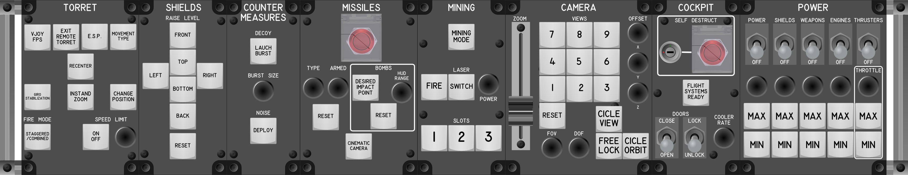
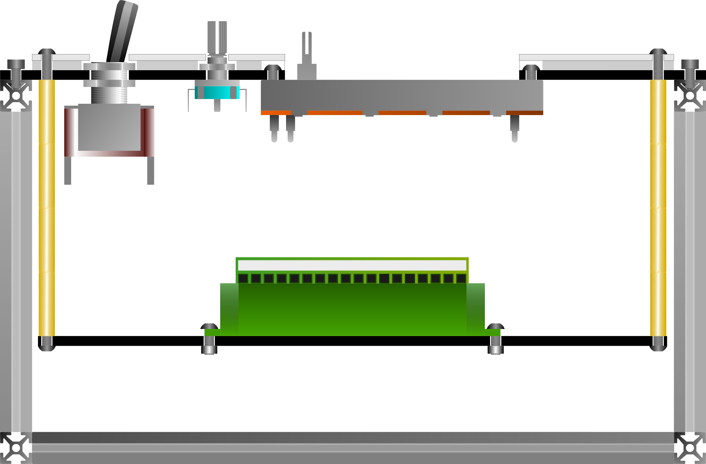

# Modular Cockpit for Star Citizen

This is a Button Box for the space simulation game [Star Citizen](https://robertsspaceindustries.com/star-citizen/).
The Button Box is made up of a series of input devices, which can be used to
make certain controls of the ship "more physical", thus facilitating the
piloting of the ship in [Star Citizen](https://robertsspaceindustries.com/star-citizen/).
This version of the Button Box is modular and  includes many more keybindings.

## Modules

The Button Box has a modular design. Each module corresponds to a set of related
functionalities.

1. [Power Module](modules/PowerModule/README.md)
1. [Camera Module](modules/CameraModule/README.md)
1. [Mining Module](modules/MiningModule/README.md)
1. [Emotes Module](modules/EmotesModule/README.md)
1. [Cockpit Module](modules/CockpitModule/README.md)
1. [Radar and Scanning Module](modules/RadarScanningModule/README.md)
1. [Torret Module](modules/TorretModule/README.md)
1. [Missiles Module](modules/MissilesModule/README.md)
1. [Docking and Landing Module](modules/DockingLandingModule/README.md)
1. [Movement Module](modules/MovementModule/README.md)
1. [Shields and Countermeasures Module](modules/ShieldsCountermeasuresModule/README.md)
1. [HUD Module](modules/HudModule/README.md)
1. [Weapons Module](modules/WeaponsModule/README.md)

## General Side View

