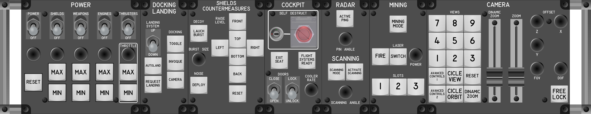

# Modular Cockpit for Star Citizen


The `Modular Cockpit` is a system of physical controls for *Star Citizen*. It is composed of `Modules` that group several interrelated physical controls such as *switches*, *potentiometers*, *encoders*, etc. For example, the `Power Module` has several *toggle switches* to turn weapons, shields, or other systems on or off; it also has *encoders* to increase or decrease power, as well as buttons to quickly set maximum or minimum power.


These `Modules` can be connected directly to the computer's USB port and the operating system recognizes them as a joystick, making it easy to perform *keybinding* in *Star Citizen*.

You can also `dock` several `Modules` to a `Control Panel`, which in turn connects to a computer USB port. When multiple `Modules` are docked to a `Control Panel`, the computer sees them all as a single joystick. This is very convenient when having a large number of `Modules` connected, preventing the operating system from failing in recognizing and operating multiple joysticks.

The `Modules` are interchangeable, meaning they can be swapped between `Control Panels` and still function easily. This way, the player can easily configure their cockpit depending on their playstyle.

Also, and very importantly, the `Modular Cockpit` is a free hardware and free software project. This means that anyone can download the designs and firmware, and build their own cockpit. They can also use it for whatever they want. In addition, they are free to study how the `Modular Cockpit` is made and modify it for their needs. Finally, they are free to redistribute it with or without changes as long as they credit where it came from and who the authors are.

## Motivations

1. [Star Citizen](https://robertsspaceindustries.com/star-citizen/) is a game with highly enriched functionality and interactivity.
1. Each ship in *Star Citizen* can perform one or more roles.
1. Each player in *Star Citizen* can play one or more roles.
1. Each role has a particular form of interactivity.
1. Each player has a different way of playing.

Therefore, each player needs a unique cockpit adapted to their playstyle. A modular, open, and adaptable cockpit is needed for *Star Citizen*.



### Definitions

<dl>
<dt>Module:</dt>
<dd>TODO</dd>

<dt>ControlPanel</dt>
<dd>TODO</dt>

<dt>Frame:<dt>
<dd>This is a structure built with <a href="https://www.makerbeam.com/makerbeam/">Makerbeam 10x10 mm</a>. It has a height of 120 mm and any necessary width. For this, <a href="https://www.makerbeam.com/makerbeam-100mm-16p-black-makerbeam.html"><i>100 mm vertical beams</i></a> are used and joined to the <a href="https://www.makerbeam.com/makerbeam/10x10mm-profiles-black/"><i>horizontal beams</i></a> with <a href="https://www.makerbeam.com/makerbeam-corner-cubes-12p-black-for-makerbeam.html">MakerBeam Corner Cubes</a>. Several <a href="https://www.makerbeam.com/makerbeam-t-slot-nuts-for-makerbeam-25p.html">T-slot nuts</a> are inserted into the horizontal beams, where the `Modules` are screwed in with M3 bolts. Any other compatible system can be used. For example, the following image shows a <i>Frame</i> 220 mm wide with its different parts.</dd>

<dt>Docking a Module</dt>
<dd>Physically placing a <i>Module</i> into a <i>Control Panel</i> so that it is fixed and connected.</dd>

<dt>Undocking a Module</dt>
<dd>Removing a Module from the Control Panel, leaving the slot free.</dd>

</dl>


## Design Requirements

### Design Requirements for `Modules`

1. Each `Module` must work independently: to function, it must not require other modules or other elements, except the computer.
1. It must be interchangeable, meaning it can be placed in any `ControlPanel` and function.
1. A module must have only one cable connected to it: the USB cable.
1. A `Module` must be screwable to the `Frame` of a `ControlPanel`.
1. A module groups several related functions. The grouping of these functions must follow the categorization given in the *Keybinding* of *Star Citizen*. For example, there is a *Vehicles - Cockpit* category, so there will be at least one module that covers that category.
1. The aesthetics of the `Modules` should resemble those of military aircraft. See [The Warthod Project](https://thewarthogproject.com/) as a reference.
1. Particular functions, such as backlighting, must work within the `Module`. If there is no dedicated control for this function, it must be controllable from the computer or from a `Control Panel` independently. 

### Design Requirements for Control Panels

1. The front part of a `ControlPanel` is a `Frame` as defined above.
1. Each `ControlPanel` must have only two cables connected to it: the USB cable and the power cable.
1. The `Modules` connected to the `Control Panel` must be seen by the computer as a single joystick. This avoids errors and problems caused by connecting many joysticks simultaneously.
1. A `Control Panel` can centralize particular functions of a `Module`, such as backlighting, to make global changes to these functions.
1. A `Control Panel` controls the ventilation function, which the `Modules` do not handle.


## Modules

1. [Salvage Module](modules/SalvageModule)
1. [Missiles Module](modules/MissilesModule)
1. [Docking and Landing Module](modules/DockingLandingModule)
1. [Shields and Countermeasures Module](modules/ShieldsCountermeasuresModule)
1. [Emotes Module](modules/EmotesModule)
1. [Movement Module](modules/MovementModule)
1. [Weapons Module](modules/WeaponsModule)
1. [Target Cycling Module](modules/TargetCyclingModule)
1. [Camera Module](modules/CameraModule)
1. [Stopwatch Module](modules/StopwatchModule)
1. [Power Module](modules/PowerModule)
1. [Targeting Module](modules/TargetingModule)
1. [Social Module](modules/SocialModule)
1. [Turret Module](modules/TorretModule)
1. [Mining Module](modules/MiningModule)
1. [Cockpit Module](modules/CockpitModule)
1. [Radar and Scanning Module](modules/RadarScanningModule)
1. [Hud Module](modules/HudModule)

## Input Devices

There are several types of input devices:

<dl>

<dt>Mechanical keyboard keys:</dt>
<dd>Mechanical keyboard keys are used for most SC keybindings because SC is designed using keys.</dd>

<dt>Encoder</dt>
<dd>For cases where there are two keys, one to increase and one to decrease the same value, such as increasing or decreasing shield energy.</dd>

<dt>Toggle Switch (ON/OFF)</dt>
<dd>These are used when there are two keys, one to turn on and one to turn off, for example turning shields on and off.</dd>

<dt>Linear Potentiometer</dt>
<dd>These are used for cases where SC has axes (axis) or absolute changes of a quantity.</dd>

<dt>Joystick</dt>
<dd>Apart from obvious cases where joysticks are used, there are keybindings that by their nature should be controlled with a joystick. A joystick is actually (at least) two orthogonal potentiometers, so they can control two orthogonal absolute variables, such as the z/y displacement of the camera.</dd>

<dt><a href="https://www.cirque.com/glidepoint-circle-trackpads">GlidePoint® Circle Trackpads</a> (like the Steam Controller)</dt>
<dd>This trackpad works very much like an analog joystick, so it can be used for the same purposes.</dd>

</dl>

## Microcontroller

* *[Teensy®](https://www.pjrc.com/teensy/)* * is used for the following reasons:

1. It works as several HID devices at the same time: it can be a keyboard, joystick, and mouse simultaneously, as well as working with serial. The latter is necessary to implement a communication protocol with the modules or in case * *Star Citizen* * implements something similar to * *DCS-BIOS* *. Having both keyboard and joystick at the same time is necessary, for example, for the ```CameraModule```, since * *Star Citizen* * has no way to map joystick keys to advanced camera functions and those can only be mapped to keyboard and mouse.
1. It has many input pins. In the case of the *Teensy 4.0*, there are 40 digital and 14 analog pins. In the *Teensy 4.1*, there are 55 digital inputs and 18 analog inputs. This is necessary since some modules require many inputs, such as the `TargetCyclingModule` with 24 digital inputs or the `PowerModule` with 30 digital inputs.
1. In addition, all digital inputs have interrupt capability. This makes input reading much faster. For example, the `TargetCyclingModule` with many encoders is much faster with interrupt capability.
1. It also has many PWM outputs. In the case of the *Teensy 4.0*, there are 31. In the case of the *Teensy 4.1*, there are 35. This is very important for controlling the backlighting of the modules.
1. The *Teensy 4.1* has a *USB Host* port, which is used in `Control Panels` to unify the `Modules` so the operating system sees them as a single joystick.
1. It has very good speed, which makes the *Teensy 4.1* preferable for unifying the modules in the `ControlPanel`.
1. It also has a good amount of memory, so this is not a concern when coding.


