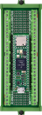
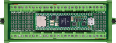

# Microcontroller - Teensy 4.0

# Links

* Teensy 4.1 [Amz: Teensy 4.1 (with Pins)](https://www.amazon.com/dp/B08CTM3279), [Amz: Teensy 4.1 ARM Cortex-M7 Processor at 600MHz with a NXP iMXRT1062 (Without pins)](https://www.amazon.com/dp/B088JY7P2H).
* Terminal Block Breakout Board Module for Teensy 4.1, Screw Mount Version [Amz: Terminal Block Breakout Board Module for Teensy 4.1, Screw Mount Version](https://www.amazon.com/dp/B08R7P8G9X).
* Terminal GPIO Breakout Board for Teensy 3.5/3.6/4.1 Module Female Pin Header 0.1" Screw Terminal 0.14" Pitch (Pack of 2) [Amz](https://www.amazon.com/dp/B0CGF11GBT)
* Breakout Board Module with Pin Board for Teensy 4.1/3.5/3.6 [Amz](https://www.amazon.com/dp/B09NXYWYK7).

## Views

* Front view with breakout and bolts 
* Horizontal front view with breakout and bolts 
