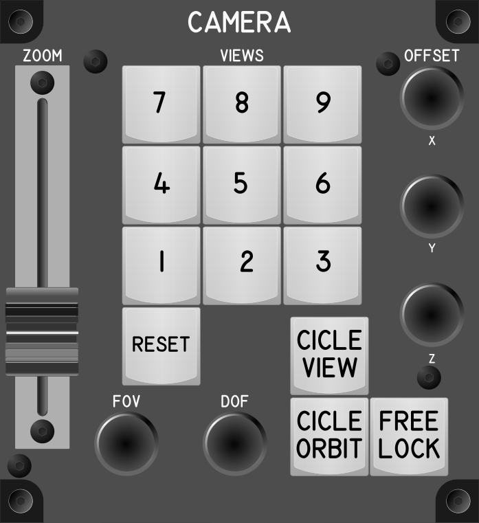

# Camera Module

## Keybindings

### Vehicles – View

| Keybinding                          | Input Device Type |
| ----------------------------------  | ----------------- |
| Cicle camera view[^4]               | key[0]            |
| Cicle camera orbit mode             | key[1]            |
| Zoom in (3rd person view)           | slide_pot[0][^1]  |
| Zoom out (3rd person view)          | slide_pot[0][^1]  |
| Freelock (Hold)                     | key[2]            |
| Dinamic Zoom In and Out (rel.)[^2]  | slide_pot[1][^1]  |
| Dinamic Zoom (toggle)               | key[3][^3]        |

[^1]: This is a potentiometer that is not circular, it is in line
[^2]: This one must be tried to see what difference it has with the other zoom.
[^3]: This must be tried because it seems to change the zoom mode.

### Camera – Advanced Camera Controls

| Keybinding                                                 | Input Device Type |
| ---------------------------------------------------------- | ----------------- |
| Advanced Camera Controls Modifier (Hold)[^4]               | key[4]            |
| Advanced Camera Controls Modifier (Hold)[^5]               | key[5]            |
| Save View 1                                                | key[6]            |
| Save View 2                                                | key[7]            |
| Save View 3                                                | key[8]            |
| Save View 4                                                | key[9]            |
| Save View 5                                                | key[10]           |
| Save View 6                                                | key[11]           |
| Save View 7                                                | key[12]           |
| Save View 8                                                | key[13]           |
| Save View 9                                                | key[14]           |
| Load View 1[^6]                                            | key[6]            |
| Load View 2                                                | key[7]            |
| Load View 3                                                | key[8]            |
| Load View 4                                                | key[9]            |
| Load View 5                                                | key[10]           |
| Load View 6                                                | key[11]           |
| Load View 7                                                | key[12]           |
| Load View 8                                                | key[13]           |
| Load View 9                                                | key[14]           |
| Clear View 9                                               | key[15]           |
| X Offset Positive                                          | encoder[0]        |
| X Offset Negative                                          | encoder[0]        |
| Y Offset Positive / Spectator Free Cam Focal Point Forward | encoder[1]        |
| Y Offset Negative / Spectator Free Cam Focal Point Forward | encoder[1]        |
| Z Offset Positive                                          | encoder[2]        |
| Z Offset Negative                                          | encoder[2]        |
| Increase FoV[^6]                                           | encoder[3]        |
| Decrease FoV[^6]                                           | encoder[3]        |
| [PH][^8] Increase DoF[^7]                                  | encoder[4]        |
| Decrease DoF[^7]                                           | encoder[4]        |
| Reset Current View                                         | key[16]           |

[^4]: This is activated by holding the `F4` key
[^5]: This is activated by holding the `Z` key
[^5]: Why do they use the same key save and load?
[^6]: FOV (field of view) or field of vision, is related to the focal length.
[^7]: DOF (depth of field) depth of field.
[^8]: What is PH?

### Total devices in keybindings

| Device               |  Count |
| -------------------- | -----: |
| Keys                 |     17 |
| Toggle switchs       |      0 |
| Slide Pot            |      2 |
| Encoders             |      5 |
| Joystick             |      0 |
