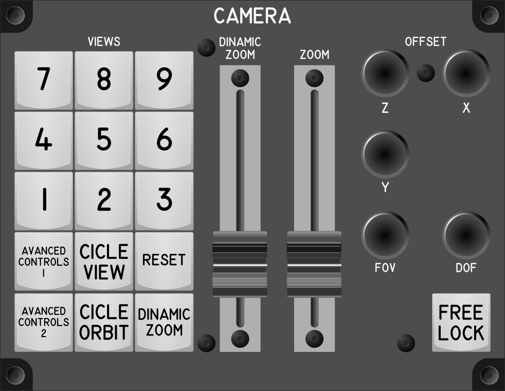

# Camera Module

## Keybindings

### Vehicles – View

| Keybinding                         | Key / Mouse            | Input Device Type      |
| ---------------------------------- | ---------------------- | ---------------------- |
| Cicle camera view[^4]              | F4                     | key[0]                 |
| Cicle camera orbit mode            |                        | key[1]                 |
| Zoom in (3rd person view)          | Mouse Wheel Up         | slide_pot[0][^1]       |
| Zoom out (3rd person view)         | Mouse Wheel Down       | slide_pot[0][^1]       |
| Freelock (Hold)                    | Z                      | toggle_switch(hold)[0] |
| Dinamic Zoom In and Out (rel.)[^2] | Left Alt + Mouse Wheel | slide_pot[1][^1]       |
| Dinamic Zoom (toggle)              |                        | key[2][^3]             |

[^1]: This is a potentiometer that is not circular, it is in line
[^2]: This one must be tried to see what difference it has with the other zoom.
[^3]: This must be tried because it seems to change the zoom mode.

### Camera – Advanced Camera Controls

| Keybinding                                                 | Key / Mouse | Input Device Type      |
| ---------------------------------------------------------- | ----------- | ---------------------- |
| Advanced Camera Controls Modifier (Hold)[^4]               | F4          | toggle_switch(hold)[1] |
| Advanced Camera Controls Modifier (Hold)[^5]               | Z           | toggle_switch(hold)[2] |
| Save View 1                                                | Numpad 1    | key[3]                 |
| Save View 2                                                | Numpad 2    | key[4]                 |
| Save View 3                                                | Numpad 3    | key[5]                 |
| Save View 4                                                | Numpad 4    | key[6]                 |
| Save View 5                                                | Numpad 5    | key[7]                 |
| Save View 6                                                | Numpad 6    | key[8]                 |
| Save View 7                                                | Numpad 7    | key[9]                 |
| Save View 8                                                | Numpad 8    | key[10]                |
| Save View 9                                                | Numpad 9    | key[11]                |
| Load View 1[^6]                                            | Numpad 1    | key[3]                 |
| Load View 2                                                | Numpad 2    | key[4]                 |
| Load View 3                                                | Numpad 3    | key[5]                 |
| Load View 4                                                | Numpad 4    | key[6]                 |
| Load View 5                                                | Numpad 5    | key[7]                 |
| Load View 6                                                | Numpad 6    | key[8]                 |
| Load View 7                                                | Numpad 7    | key[9]                 |
| Load View 8                                                | Numpad 8    | key[10]                |
| Load View 9                                                | Numpad 9    | key[11]                |
| Clear View 9                                               | Numpad 0    | key[12]                |
| X Offset Positive                                          | Right Arrow | encoder[0]             |
| X Offset Negative                                          | Left Arrow  | encoder[0]             |
| Y Offset Positive / Spectator Free Cam Focal Point Forward | Up Arrow    | encoder[1]             |
| Y Offset Negative / Spectator Free Cam Focal Point Forward | Down Arrow  | encoder[1]             |
| Z Offset Positive                                          | Page Up     | encoder[2]             |
| Z Offset Negative                                          | Page Down   | encoder[2]             |
| Increase FoV[^6]                                           | Numpad +    | encoder[3]             |
| Decrease FoV[^6]                                           | Numpad -    | encoder[3]             |
| [PH][^8] Increase DoF[^7]                                  | Home        | encoder[4]             |
| Decrease DoF[^7]                                           | End         | encoder[4]             |
| Reset Current View                                         | Numpad *    | key[13]                |

[^4]: This is activated by holding the `F4` key
[^5]: This is activated by holding the `Z` key
[^5]: Why do they use the same key save and load?
[^6]: FOV (field of view) or field of vision, is related to the focal length.
[^7]: DOF (depth of field) depth of field.
[^8]: What is PH?

### Total devices in keybindings

| Device                |  Count |
| --------------------- | -----: |
| Keys                  |     14 |
| Toggle switchs        |      0 |
| Toggle switchs (hold) |      3 |
| Slide Pot             |      2 |
| Encoders              |      5 |
| Slide Pot             |      2 |
| Joystick              |      0 |
