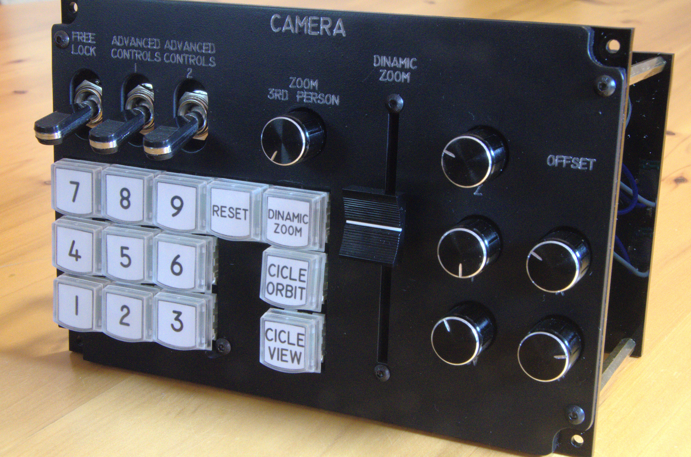
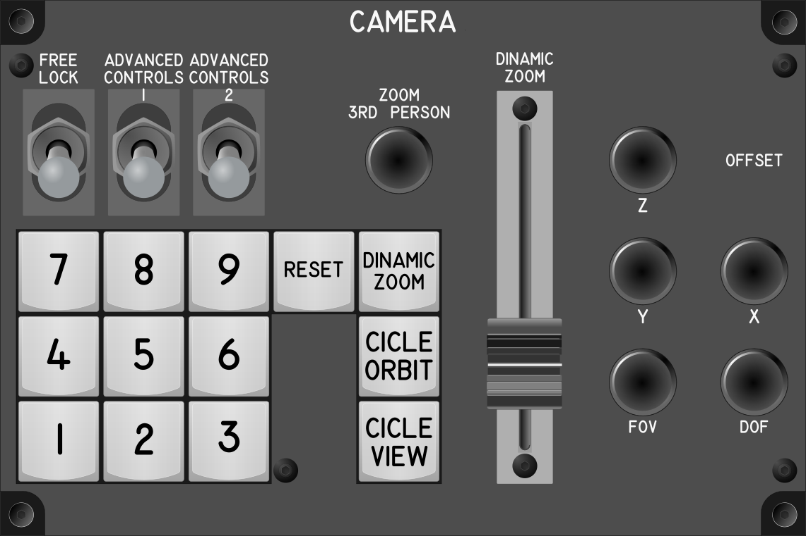

# Camera Module

## Design

## Keybindings

### Vehicles – View

| Keybinding                         | Joy  | Key / Mouse            | Input Device Type      |
| ---------------------------------- | ---- | ---------------------- | ---------------------- |
| Cicle camera view[^4]              | Key  | F4                     | key[0]                 |
| Cicle camera orbit mode            | Key  |                        | key[1]                 |
| Zoom in (3rd person view)          | Key  | Mouse Wheel Up         | encoder[0]             |
| Zoom out (3rd person view)         | Key  | Mouse Wheel Down       | encoder[0]             |
| Freelock (Hold)                    | Key  | Z                      | toggle_switch(hold)[0] |
| Dinamic Zoom In and Out (rel.)[^2] | Axis | Left Alt + Mouse Wheel | slide_pot[1][^1]       |
| Dinamic Zoom (toggle)              | Key  |                        | key[2][^3]             |

[^1]: This is a potentiometer that is not circular, it is in line
[^2]: This one must be tried to see what difference it has with the other zoom.
[^3]: This must be tried because it seems to change the zoom mode.

### Camera – Advanced Camera Controls

| Keybinding                                                 | Joy | Key / Mouse | Input Device Type      |
| ---------------------------------------------------------- | --- |------------ | ---------------------- |
| Advanced Camera Controls Modifier 1 (Hold)                 |     | F4          | toggle_switch(hold)[1] |
| Advanced Camera Controls Modifier 2 (Hold)                 |     | Z           | toggle_switch(hold)[2] |
| Save View 1                                                |     | Numpad 1    | key[3]                 |
| Save View 2                                                |     | Numpad 2    | key[4]                 |
| Save View 3                                                |     | Numpad 3    | key[5]                 |
| Save View 4                                                |     | Numpad 4    | key[6]                 |
| Save View 5                                                |     | Numpad 5    | key[7]                 |
| Save View 6                                                |     | Numpad 6    | key[8]                 |
| Save View 7                                                |     | Numpad 7    | key[9]                 |
| Save View 8                                                |     | Numpad 8    | key[10]                |
| Save View 9                                                |     | Numpad 9    | key[11]                |
| Load View 1[^4]                                            |     | Numpad 1    | key[3]                 |
| Load View 2                                                |     | Numpad 2    | key[4]                 |
| Load View 3                                                |     | Numpad 3    | key[5]                 |
| Load View 4                                                |     | Numpad 4    | key[6]                 |
| Load View 5                                                |     | Numpad 5    | key[7]                 |
| Load View 6                                                |     | Numpad 6    | key[8]                 |
| Load View 7                                                |     | Numpad 7    | key[9]                 |
| Load View 8                                                |     | Numpad 8    | key[10]                |
| Load View 9                                                |     | Numpad 9    | key[11]                |
| Clear View 9                                               |     | Numpad 0    | key[12]                |
| X Offset Positive                                          |     | Right Arrow | encoder[1]             |
| X Offset Negative                                          |     | Left Arrow  | encoder[1]             |
| Y Offset Positive / Spectator Free Cam Focal Point Forward |     | Up Arrow    | encoder[2]             |
| Y Offset Negative / Spectator Free Cam Focal Point Forward |     | Down Arrow  | encoder[2]             |
| Z Offset Positive                                          |     | Page Up     | encoder[3]             |
| Z Offset Negative                                          |     | Page Down   | encoder[3]             |
| Increase FoV[^5]                                           | Key | Numpad +    | encoder[4]             |
| Decrease FoV[^5]                                           | Key | Numpad -    | encoder[4]             |
| [PH][^7] Increase DoF[^6]                                  | Key | Home        | encoder[5]             |
| Decrease DoF[^6]                                           | Key | End         | encoder[5]             |
| Reset Current View                                         | Key | Numpad *    | key[13]                |

[^4]: Why do they use the same key save and load?-
[^5]: FOV (field of view) or field of vision, is related to the focal length.
[^6]: DOF (depth of field) depth of field.
[^7]: What is PH?

### Total devices in keybindings

| Device                |  Count |
| --------------------- | -----: |
| Keys                  |     14 |
| Toggle switchs        |      0 |
| Toggle switchs (hold) |      3 |
| Slide Pot             |      2 |
| Encoders              |      6 |
| Slide Pot             |      2 |
| Joystick              |      0 |

## Bill of materials

| Material                                                                                                                                  | Qty. | Links                                                                  |
| ----------------------------------------------------------------------------------------------------------------------------------------- | ---: | ------------------------------------------------------------------------------- |
| Twidec/Heavy Duty Rocker Toggle Switch 16A 250V SPST 2 Position 2 Pin ON/Off Switch with Black PC Wear-Resistant Handle TEN-A-2210BK-A101 |    3 | [Amz](https://www.amazon.com/dp/B07VJ4GQPW)                                     |
| (7 Pin 20MM)10 PCS 360 Degree EC11 Rotary Encoder Code Switch Digital Potentiometer with Caps                                             |    6 | [Amz](https://www.amazon.com/dp/B08BFJ4F5C)                                     |
| Jade Kailh Box Key Switches                                                                                                               |   13 | [Amz (One Package)](https://www.amazon.com/dp/B09WYV6MTJ), [Amz (One Package)](https://www.amazon.com/dp/B0B9BDM57S) |
| Slide Pot - X-Large (10k Linear Taper)                                                                                                    |    1 | [Sparkfun](https://www.sparkfun.com/slide-pot-x-large-10k-linear-taper.html)     |
| Slide Potentiometer Knob - X-Large                                                                                                        |    1 | [Sparkfun](https://www.sparkfun.com/slide-potentiometer-knob-x-large.html), [Amz](https://www.amazon.com/Electronics123-com-Inc-Slide-Potentiometer-Knob/dp/B01K2BZLA0)   |
| Teensy 4.0                                                                                                                                |    1 | [Amz](https://www.amazon.com/dp/B07W5J3WNH)                                     |
| Terminal Block Breakout Board Module for Teensy 4.0, Screw Mount Version                                                                  |    1 | [Amz](https://www.amazon.com/dp/B08R7PVCFN)                                     |
| Female to Female Thread Spacer Screws Brass Hex Standoff M3 x 60mm                                                                        |    4 | [Amz](https://www.amazon.com/dp/B09V272N1N)                                     |
| 3Mx6 Socket Head Cap Bolts                                                                                                                |    4 | 1 package[Amz](https://www.amazon.com/dp/B00W8YSCIS)                            |
| 3M Flat Washers                                                                                                                           |    8 | In one package [Amz](https://www.amazon.com/dp/B08CHHLQQS)                      |
| 3Mx12 Button Head Socket Cap Bolts                                                                                                        |    2 | In one package [Amz](https://www.amazon.com/dp/B08CHHLQQS)                      |
| 3Mx5 Button Head Socket Cap Bolts                                                                                                         |    4 | In one package [Amz](https://www.amazon.com/dp/B08CHHLQQS)                      |
| Plastic Primer                                                                                                                            |    1 | [mtn](https://www.montanacolors.com/en/productos/mtn-pro-plastic-primer-spray/) |
| Black Matte Paint R-9011                                                                                                                  |    1 | [mtn](https://www.montanacolors.com/en/productos/mtn-94-aerosol-spray-paint/)   |
| 2mm white acrylic                                                                                                                         |    1 |                                                                                 |
| 3mm translucent acrylic                                                                                                                   |    1 |                                                                                 |
| 3mm black acrylic                                                                                                                         |    1 |                                                                                 |
| 3mm black acrylic                                                                                                                         |    1 |                                                                                 |

## Key labels

[Key Labels](images/ModuleKeyLabels.pdf)
