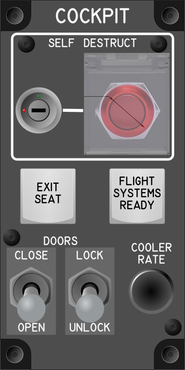

# Cockpit Module

## Keybindings

### Vehicles – Cockpit

| Keybinding             | Input Device Type     |
| ---------------------- | ----------------------|
| Self Destruct          | key[0]                |
| Increase Cooler Rate   | encoder[0]            |
| Decrease Cooler Rate   | encoder[0]            |
| Flight / Systems Ready | key[1]                |
| Open All Doors         | toggle_switch[0]: on  |
| Close All Doors        | toggle_switch[0]: off |
| Lock All Doors         | toggle_switch[1]: on  |
| Unlock All Doors       | toggle_switch[1]: off |

### Vehicles – Seats and Operator Modes

| Keybinding             | Input Device Type     |
| ---------------------- | ----------------------|
| Emergency exit seat    | key[2]                |

### Total devices in keybindings

| Device                            |  Count |
| --------------------------------- | -----: |
| Keys                              |      1 |
| Toggle switchs                    |      2 |
| Encoders                          |      1 |
| Slide                             |      0 |
| Joysticks                         |      0 |
| Keylock switch                    |      1 |
| Momentary Flat Push Button Switch |      1 |
| Cover momentary push buttom       |      1 |
