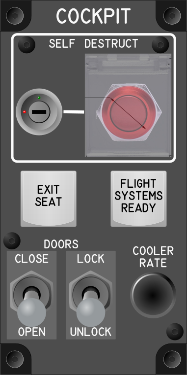

# Cockpit Module

## Keybindings

### Vehicles – Cockpit

| Keybinding             | Input Device Type     |
| ---------------------- | ----------------------|
| Self Destruct          | key[0]                |
| Increase Cooler Rate   | encoder[0]            |
| Decrease Cooler Rate   | encoder[0]            |
| Flight / Systems Ready | key[1]                |
| Open All Doors         | toggle_switch[0]: on  |
| Close All Doors        | toggle_switch[0]: off |
| Lock All Doors         | toggle_switch[1]: on  |
| Unlock All Doors       | toggle_switch[1]: off |

### Vehicles – Seats and Operator Modes

| Keybinding             | Input Device Type     |
| ---------------------- | ----------------------|
| Emergency exit seat    | key[2]                |

### Total devices in keybindings

| Device                            |  Count |
| --------------------------------- | -----: |
| Keys                              |      1 |
| Toggle switchs                    |      2 |
| Encoders                          |      1 |
| Slide                             |      0 |
| Joysticks                         |      0 |
| Keylock switch                    |      1 |
| Momentary Flat Push Button Switch |      1 |
| Cover momentary push buttom       |      1 |

## Bill of materials

| Material                                                                                                                                       | Qty. | Links                                                                  |
| ---------------------------------------------------------------------------------------------------------------------------------------------- | ---: | ------------------------------------------------------------------------------- |
| Twidec/Heavy Duty Rocker Toggle Switch 16A 250V SPST 2 Position 2 Pin ON/Off Switch with Black PC Wear-Resistant Handle TEN-A-2210BK-A101      |    2 | [Amz](https://www.amazon.com/dp/B07VJ4GQPW)                                     |
| (7 Pin 20MM)10 PCS 360 Degree EC11 Rotary Encoder Code Switch Digital Potentiometer with Caps                                                  |    1 | [Amz](https://www.amazon.com/dp/B08BFJ4F5C)                                     |
| Jade Kailh Box Key Switches                                                                                                                    |    2 | [Amz (One Package)](https://www.amazon.com/dp/B09WYV6MTJ), [Amz (One Package)](https://www.amazon.com/dp/B0B9BDM57S) |
| Taiss 2Pcs 16mm 5/8" Red Metal Momentary Push Button Switch 1NO SPST 3A/ 12-250V for Industrial Car Switch P-M16R                              |    1 | [Amz](https://www.amazon.com/dp/B07R131RZG)                                     |
| DaierTek 16mm Dustproof Safety Push Button Cap Cover Guard Plastic Protector Child Proof for 16mm Push Button Switch Computer Light Pad -2Pack |    1 | [Amz](https://www.amazon.com/dp/B07VF4F9JL)                                     |
| Uxcell a11112200ux0536 Electric 2 Positions ON Off Metal Keylock Switch w Keys                                                                 |    1 | [Amz](https://www.amazon.com/dp/B019I12414)                                     |
| Teensy 4.0                                                                                                                                |    1 | [Amz](https://www.amazon.com/dp/B07W5J3WNH)                                     |
| Terminal Block Breakout Board Module for Teensy 4.0, Screw Mount Version                                                                  |    1 | [Amz](https://www.amazon.com/dp/B08R7PVCFN)                                     |
| Female to Female Thread Spacer Screws Brass Hex Standoff M3 x 60mm                                                                        |    4 | [Amz](https://www.amazon.com/dp/B09V272N1N)                                     |
| 3Mx6 Socket Head Cap Bolts                                                                                                                |    4 | 1 package[Amz](https://www.amazon.com/dp/B00W8YSCIS)                            |
| 3M Flat Washers                                                                                                                           |    8 | In one package [Amz](https://www.amazon.com/dp/B08CHHLQQS)                      |
| 3Mx12 Button Head Socket Cap Bolts                                                                                                        |    2 | In one package [Amz](https://www.amazon.com/dp/B08CHHLQQS)                      |
| 3Mx5 Button Head Socket Cap Bolts                                                                                                         |    4 | In one package [Amz](https://www.amazon.com/dp/B08CHHLQQS)                      |
| Plastic Primer                                                                                                                            |    1 | [mtn](https://www.montanacolors.com/en/productos/mtn-pro-plastic-primer-spray/) |
| Black Matte Paint R-9011                                                                                                                  |    1 | [mtn](https://www.montanacolors.com/en/productos/mtn-94-aerosol-spray-paint/)   |
| 2mm white acrylic                                                                                                                         |    1 |                                                                                 |
| 3mm translucent acrylic                                                                                                                   |    1 |                                                                                 |
| 3mm black acrylic                                                                                                                         |    1 |                                                                                 |
| 3mm black acrylic                                                                                                                         |    1 |                                                                                 |

## Key labels

[Key Labels](images/ModuleKeyLabels.pdf)
