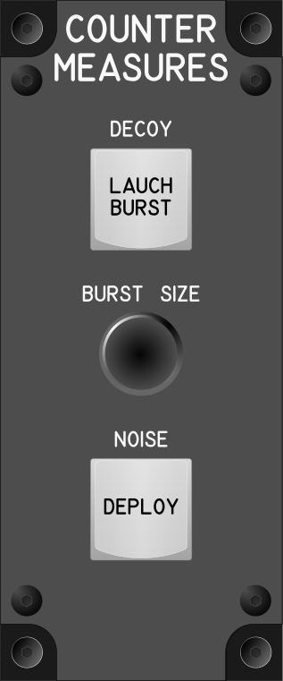

# Módulo de Contramedidas (Countermeasures Module)

## Keybindings

| Keybinding                                             | Tipo de dispositivo de entrada |
| ------------------------------------------------------ | ------------------------------ |
| Decoy – Lauch Burst (tab), Set and Launch Burst (hold) | key[0]                         |
| Decoy – Increase Burst Size (tab)                      | encoder[0]: increase           |
| Decoy – Increase Burst Size (tab)                      | encoder[0]: decrease           |
| Noise – Deploy (tab)                                   | key[1]                         |
