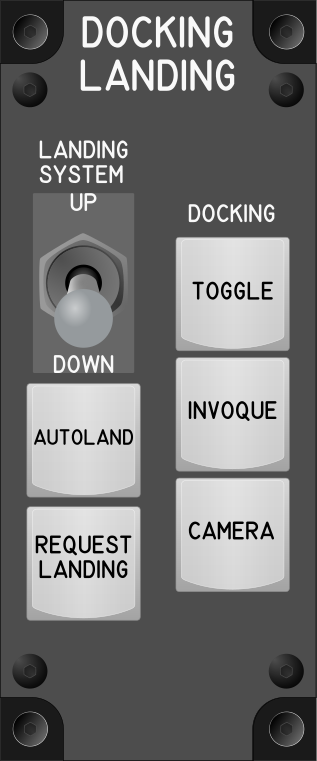

# Docking Landing Module

## Keybindings

| Keybinding            | Input Device Type |
| ----------------------| ----------------- |
| Toggle Dockin Mode    | key[0]            |
| Invoque Dockin        | key[1]            |
| Toggle Docking Camera | key[2]            |

### Flight – Movement

| Keybinding            |   Input Device Type   |
| ----------------------| --------------------- |
| Landing System On     | toggle_switch[2]: on  |
| Landing System Off    | toggle_switch[2]: off |
| Request Landing       | key[3]                |

### Total devices in keybindings

| Device               | Count  |
| -------------------- | -----: |
| Keys                 |      4 |
| Toggle switchs       |      1 |
| Encoders             |      0 |
| Slide                |      0 |
| Joystick             |      0 |
