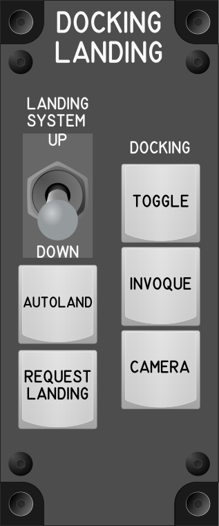

# Docking Landing Module

## Keybindings

| Keybinding            | Input Device Type |
| ----------------------| ----------------- |
| Toggle Dockin Mode    | key[0]            |
| Invoque Dockin        | key[1]            |
| Toggle Docking Camera | key[2]            |

### Flight – Movement

| Keybinding             |   Input Device Type   |
| -----------------------| --------------------- |
| Landing System Retract | toggle_switch[2]: on  |
| Landing System Deploy  | toggle_switch[2]: off |
| Request Landing        | key[3]                |
| Autoland               | key[4]                |

### Total devices in keybindings

| Device               | Count  |
| -------------------- | -----: |
| Keys                 |      5 |
| Toggle switchs       |      1 |
| Encoders             |      0 |
| Slide                |      0 |
| Joystick             |      0 |

## Bill of materials

| Material                                                                                                                                  | Qty. | Links                                                                  |
| ----------------------------------------------------------------------------------------------------------------------------------------- | ---: | ------------------------------------------------------------------------------- |
| Twidec/Heavy Duty Rocker Toggle Switch 16A 250V SPST 2 Position 2 Pin ON/Off Switch with Black PC Wear-Resistant Handle TEN-A-2210BK-A101 |    1 | [Amz](https://www.amazon.com/dp/B07VJ4GQPW)                                     |
| Jade Kailh Box Key Switches                                                                                                               |    5 | [Amz (One Package)](https://www.amazon.com/dp/B09WYV6MTJ), [Amz (One Package)](https://www.amazon.com/dp/B0B9BDM57S) |

## Key labels

[Key Labels](images/ModuleKeyLabels.pdf)
