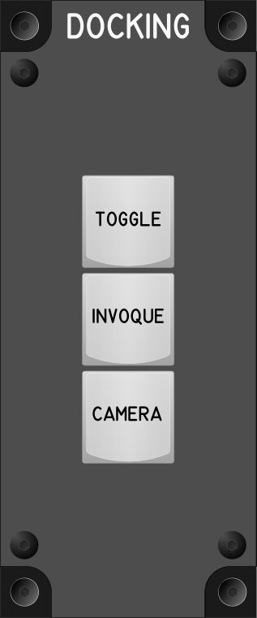

# Docking Module

## Keybindings

| Keybinding            | Input Device Type |
| ----------------------| ----------------- |
| Toggle Dockin Mode    | key[0]            |
| Invoque Dockin        | key[1]            |
| Toggle Docking Camera | key[2]            |

### Total devices in the keybindings

| Dispositivo          | Numero |
| -------------------- | -----: |
| Keys                 |      3 |
| Toggle switchs       |      0 |
| Encoders             |      0 |
| Slide                |      0 |
| Joystick             |      0 |
