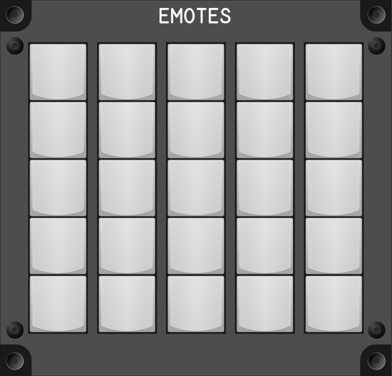

# Emotes Module

## Keybindings

There are 40 Emote keybindings.

## Diseño

With a space of 10x10 cm you can only have 25 keys, but you can have layers, a maximum of two layers would be necessary. These layers can be activated for example with the two corner keys at the bottom. (With that you would have about 23 * 3 = 69 emotes). The problem here is remembering where each emote is. It would be necessary to design a key labels that facilitate this.
