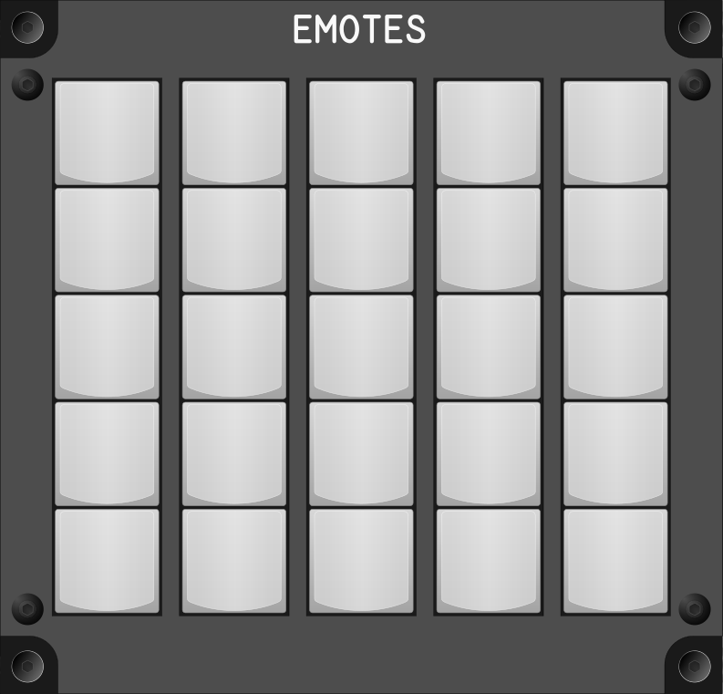

# Emotes Module

## Key labels

[Key Labels](images/ModuleKeyLabels.pdf)

## Keybindings

 Star Citizen Version 4.2.1
 
| Keybinding                                           |  Key / Mouse | Joy | Input Device Type     |
| ---------------------------------------------------- | ------------ | --- | --------------------- |
| Forward                                              | Numpad 5     | Key | key[0] (Joystick)     |
| Left                                                 | Numpad 1     | Key | key[1] (Joystick)     |
| Right                                                | Numpad 3     | Key | key[2] (Joystick)     |
| Stop                                                 | Numpad 2     | Key | key[3] (Joystick)     |
| Yes                                                  | Numpad 4     | Kay | key[4] (Joystick)     |
| No                                                   | Numpad 6     | Key | key[5] (Joystick)     |
| Agree                                                |              | Key | key[6] (Joystick)     |
| Angry                                                |              | Key | key[7] (Joystick)     |
| At Easy                                              |              | Key | key[8] (Joystick)     |
| Attention                                            |              | Key | key[9] (Joystick)     |
| Blah                                                 |              | Key | key[10] (Joystick)    |
| Bored                                                |              | Key | key[11] (Joystick)    |
| Bow                                                  |              | Key | key[12] (Joystick)    |
| Burp                                                 |              | Key | key[13] (Joystick)    |
| Cheer                                                |              | Key | key[14] (Joystick)    |
| Chicken                                              |              | Key | key[15] (Joystick)    |
| Clep                                                 |              | Key | key[16] (Joystick)    |
| Come                                                 |              | Key | key[17] (Joystick)    |
| Cry                                                  |              | Key | key[18] (Joystick)    |
| Dance                                                |              | Key | key[19] (Joystick)    |
| Disagree                                             |              | Key | key[20] (Joystick)    |
| Failure                                              |              | Key | key[21] (Joystick)    |
| Flex                                                 |              | Key | key[22] (Joystick)    |
| Flirt                                                |              | Key | key[23] (Joystick)    |
| Gasp                                                 |              | Key | key[24] (Joystick)    |
| Gloat                                                |              | Key | key[25] (Joystick)    |
| Greet                                                |              | Key | key[26] (Joystick)    |
| Confirm Launch                                       |              | Key | key[27] (Joystick)    |
| Point                                                |              | Key | key[28] (Joystick)    |
| Rude                                                 |              | Key | key[29] (Joystick)    |
| Salute                                               |              | Key | key[30] (Joystick)    |
| Sit                                                  |              | Key | key[31] (Joystick)    |
| Sleep                                                |              | Key | key[32] (Joystick)    |
| Smell                                                |              | Key | key[33] (Joystick)    |
| Taunt                                                |              | Key | key[34] (Joystick)    |
| Threaten                                             |              | Key | key[35] (Joystick)    |
| Wait                                                 |              | Key | key[36] (Joystick)    |
| Wave                                                 |              | Key | key[37] (Joystick)    |
| Whisle                                               |              | Key | key[38] (Joystick)    |

There are 40 Emote keybindings.

## Diseño

With a space of 10x10 cm you can only have 25 keys, but you can have layers, a maximum of two layers would be necessary. These layers can be activated for example with the two corner keys at the bottom. (With that you would have about 23 * 3 = 69 emotes). The problem here is remembering where each emote is. It would be necessary to design a key labels that facilitate this.

## Bill of materials

| Material                                                                                                                                  | Qty. | Links                                                                  |
| ----------------------------------------------------------------------------------------------------------------------------------------- | ---: | ------------------------------------------------------------------------------- |
| Jade Kailh Box Key Switches                                                                                                               |   25 | [Amz (One Package)](https://www.amazon.com/dp/B09WYV6MTJ), [Amz (One Package)](https://www.amazon.com/dp/B0B9BDM57S) |3-com-Inc-Slide-Potentiometer-Knob/dp/B01K2BZLA0)   |
| Teensy 4.0                                                                                                                                |    1 | [Amz](https://www.amazon.com/dp/B07W5J3WNH)                                     |
| Terminal Block Breakout Board Module for Teensy 4.0, Screw Mount Version                                                                  |    1 | [Amz](https://www.amazon.com/dp/B08R7PVCFN)                                     |
| Female to Female Thread Spacer Screws Brass Hex Standoff M3 x 60mm                                                                        |    4 | [Amz](https://www.amazon.com/dp/B09V272N1N)                                     |
| 3Mx6 Socket Head Cap Bolts                                                                                                                |    4 | 1 package[Amz](https://www.amazon.com/dp/B00W8YSCIS)                            |
| 3M Flat Washers                                                                                                                           |    8 | In one package [Amz](https://www.amazon.com/dp/B08CHHLQQS)                      |
| 3Mx12 Button Head Socket Cap Bolts                                                                                                        |    2 | In one package [Amz](https://www.amazon.com/dp/B08CHHLQQS)                      |
| 3Mx5 Button Head Socket Cap Bolts                                                                                                         |    4 | In one package [Amz](https://www.amazon.com/dp/B08CHHLQQS)                      |
| Plastic Primer                                                                                                                            |    1 | [mtn](https://www.montanacolors.com/en/productos/mtn-pro-plastic-primer-spray/) |
| Black Matte Paint R-9011                                                                                                                  |    1 | [mtn](https://www.montanacolors.com/en/productos/mtn-94-aerosol-spray-paint/)   |
| 2mm white acrylic                                                                                                                         |    1 |                                                                                 |
| 3mm translucent acrylic                                                                                                                   |    1 |                                                                                 |
| 3mm black acrylic                                                                                                                         |    1 |                                                                                 |
| 3mm black acrylic                                                                                                                         |    1 |                                                                                 |

## Key labels

[Key Labels](images/ModuleKeyLabels.pdf)
