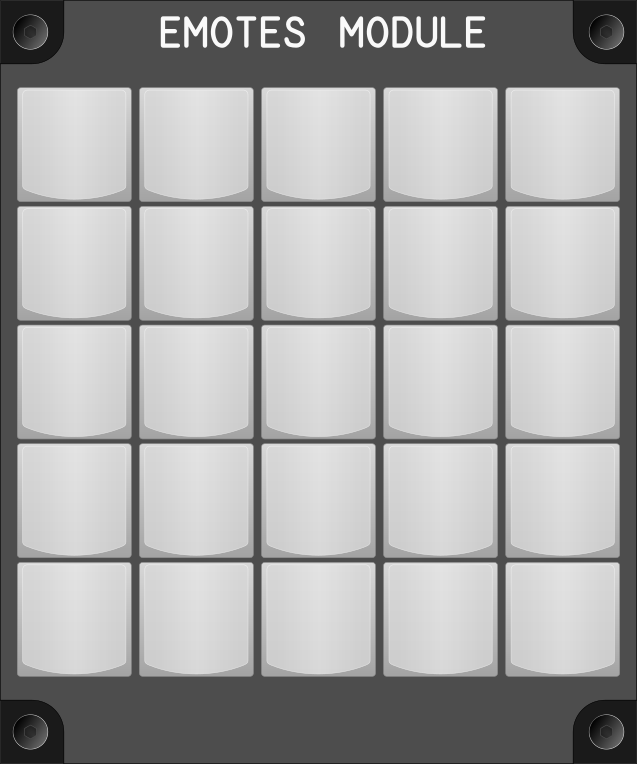

# Módulo de Emotes (Emotes Module)

## Keybindings

Hay 40 keybindings de Emotes.

## Diseño

Con una espacio de 10x10 cm sólo se pueden tener 25 teclas, pero se pueden tener
capas, serían necesarias máximo dos capas. Estas capas se pueden activar por
ejemplo con las dos teclas de las esquinas en la parte inferior. (Con eso se
  tendrían cerca de 23 * 3 = 69 emotes. El problema aquí es recordar donde está
  cada emote. Habría que diseñar una etiquetas de teclas que faciliten esto.
