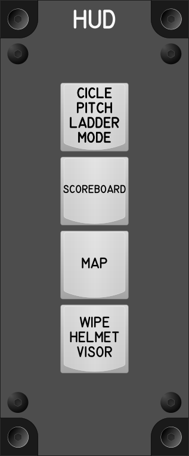

# HUD Module

## Keybindings

| Keybinding              | Input Device Type |
| ----------------------- | ----------------- |
| Cicle Pitch Ladder Mode | key[0]            |
| Scoreboard              | key[1]            |
| Map                     | key[2]            |
| Wipe Helmet Visor       | key[3]            |
| Wipe Helmet Visor       | key[3]            |

### Total devices in keybindings

| Device               | Count  |
| -------------------- | -----: |
| Keys                 |      4 |
| Toggle switchs       |      0 |
| Encoders             |      0 |
| Slide                |      0 |
| Joystick             |      0 |

## Key Labels

[Key Labels](images/ModuleKeyLabels.pdf)
