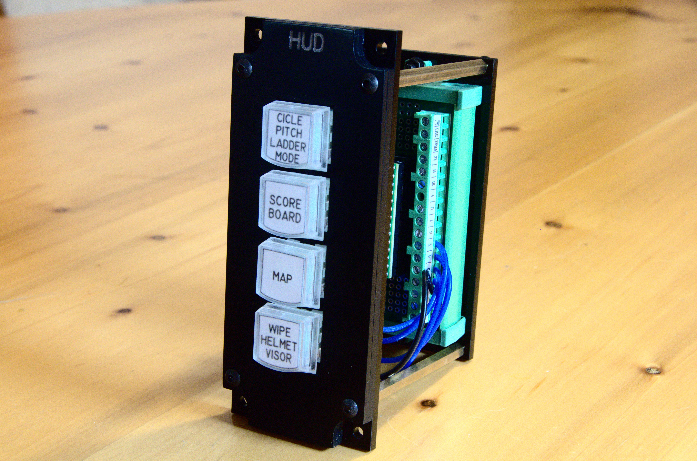
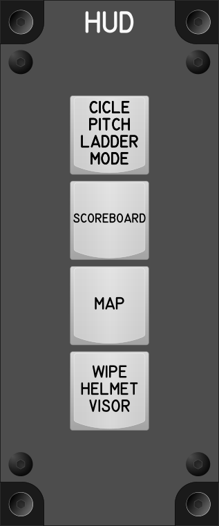

# HUD Module

## Design

## Keybindings

| Keybinding              | Input Device Type |
| ----------------------- | ----------------- |
| Cicle Pitch Ladder Mode | key[0]            |
| Scoreboard              | key[1]            |
| Map                     | key[2]            |
| Wipe Helmet Visor       | key[3]            |
| Wipe Helmet Visor       | key[3]            |

### Total devices in keybindings

| Device               | Count  |
| -------------------- | -----: |
| Keys                 |      4 |
| Toggle switchs       |      0 |
| Encoders             |      0 |
| Slide                |      0 |
| Joystick             |      0 |

## Bill of materials

| Material                                                                                                                                  | Qty. | Links                                                                  |
| ----------------------------------------------------------------------------------------------------------------------------------------- | ---: | ------------------------------------------------------------------------------- |
| Jade Kailh Box Key Switches                                                                                                               |    4 | [Amz (One Package)](https://www.amazon.com/dp/B09WYV6MTJ), [Amz (One Package)](https://www.amazon.com/dp/B0B9BDM57S) |3-com-Inc-Slide-Potentiometer-Knob/dp/B01K2BZLA0)   |
| Teensy 4.0                                                                                                                                |    1 | [Amz](https://www.amazon.com/dp/B07W5J3WNH)                                     |
| Terminal Block Breakout Board Module for Teensy 4.0, Screw Mount Version                                                                  |    1 | [Amz](https://www.amazon.com/dp/B08R7PVCFN)                                     |
| Female to Female Thread Spacer Screws Brass Hex Standoff M3 x 60mm                                                                        |    4 | [Amz](https://www.amazon.com/dp/B09V272N1N)                                     |
| 3Mx6 Socket Head Cap Bolts                                                                                                                |    4 | 1 package[Amz](https://www.amazon.com/dp/B00W8YSCIS)                            |
| 3M Flat Washers                                                                                                                           |    8 | In one package [Amz](https://www.amazon.com/dp/B08CHHLQQS)                      |
| 3Mx12 Button Head Socket Cap Bolts                                                                                                        |    2 | In one package [Amz](https://www.amazon.com/dp/B08CHHLQQS)                      |
| 3Mx5 Button Head Socket Cap Bolts                                                                                                         |    4 | In one package [Amz](https://www.amazon.com/dp/B08CHHLQQS)                      |
| Plastic Primer                                                                                                                            |    1 | [mtn](https://www.montanacolors.com/en/productos/mtn-pro-plastic-primer-spray/) |
| Black Matte Paint R-9011                                                                                                                  |    1 | [mtn](https://www.montanacolors.com/en/productos/mtn-94-aerosol-spray-paint/)   |
| 2mm white acrylic                                                                                                                         |    1 |                                                                                 |
| 3mm translucent acrylic                                                                                                                   |    1 |                                                                                 |
| 3mm black acrylic                                                                                                                         |    1 |                                                                                 |
| 3mm black acrylic                                                                                                                         |    1 |                                                                                 |

## Key Labels

[Key Labels](images/ModuleKeyLabels.pdf)
