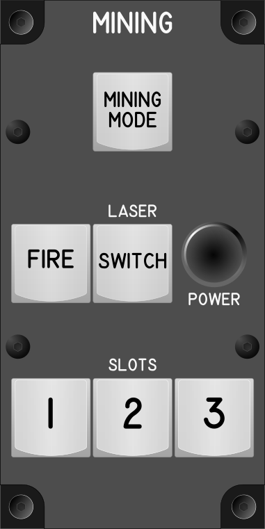

# Módulo de Minería (Mining Module)

## Keybindings

### Vehicles – Seats and Operator Modes

| Keybinding                                                       | Tipo de dispositivo de entrada                    |
| ---------------------------------------------------------------- | ------------------------------------------------- |
| Mining Mode (Toggle)                                             | key[0]                                            |

### Vehicles – Mining

| Keybinding                                                       | Tipo de dispositivo de entrada                    |
| ---------------------------------------------------------------- | ------------------------------------------------- |
| Fire Mining Laser (toggle)                                       | key[1] (Mouse Buttton 1)                          |
| Switch Mining Laser (toggle)                                     | key[2] (Mouse Buttton 2)                          |
| Increase Mining Laser Power                                      | Encoder[0] (Mouse Wheel Up)                       |
| Decrease Mining Laser Power                                      | Encoder[0] (Mouse Wheel Down)                     |
| Activate Mining Module (Slot 1)                                  | key[3]                                            |
| Activate Mining Module (Slot 2)                                  | key[4]                                            |
| Activate Mining Module (Slot 3)                                  | key[5]                                            |
| Jettinson Cargo[^1]                                              | key[6]                                            |

[^1]: TODO Averiguar que hace.

### Total de dispositivos usados en los keybindings

| Dispositivo          | Numero |
| -------------------- | -----: |
| Keys                 |      7 |
| Toggle switchs       |      0 |
| Encoders             |      1 |
