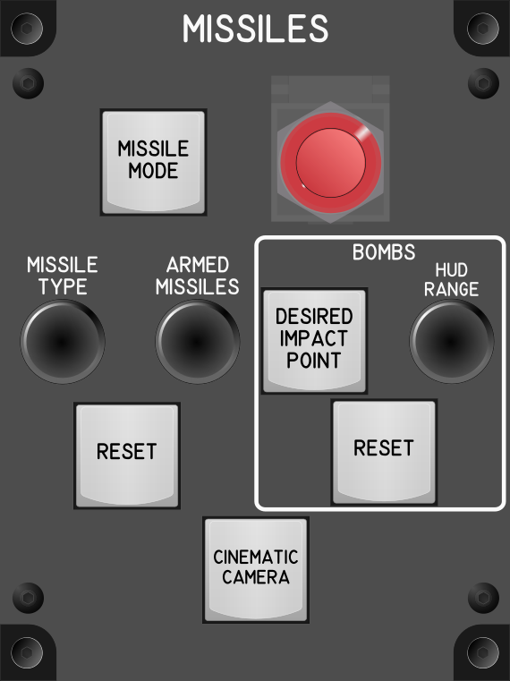

# Missiles Module

## Keybindings

| Keybinding                             | Input Device Type              |
| ---------------------------------------| -------------------------------|
| Launch Missiles                        | key[0]                         |
| Cycle Next Missile Type                | encoder[0]: increase           |
| Cycle Previous Missile Type            | encoder[0]: decrease           |
| Increase Number of Armed Missiles      | encoder[1]: increase           |
| Decrease Number of Armed Missiles      | encoder[1]: decrease           |
| Reset Number of Armed Missiles         | key[1]                         |
| [PH] Bombs Toggle Desired Impact Point | key[2]                         |
| Bombs - Increase HUD Range             | encoder[2]: increase           |
| Bombs – Decrease HUD Range             | encoder[2]: decrease           |
| Bombs – Reset HUD Range                | key[3]                         |
| [PH] Enable Cinematic Camera (toggle)  | key[4]                         |
| Missile Operator Mode                  | key[5]                         |

### Total devices in keybindings

| Device                            |  Count |
| --------------------------------- | -----: |
| Keys                              |      5 |
| Toggle switchs                    |      0 |
| Encoders                          |      3 |
| Momentary Flat Push Button Switch |      1 |
| Cover momentary push buttom       |      1 |
