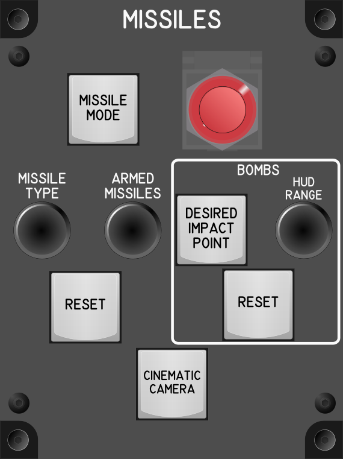

# Missiles Module

## Keybindings

| Keybinding                             | Input Device Type              |
| ---------------------------------------| -------------------------------|
| Launch Missiles                        | key[0]                         |
| Cycle Next Missile Type                | encoder[0]: increase           |
| Cycle Previous Missile Type            | encoder[0]: decrease           |
| Increase Number of Armed Missiles      | encoder[1]: increase           |
| Decrease Number of Armed Missiles      | encoder[1]: decrease           |
| Reset Number of Armed Missiles         | key[1]                         |
| [PH] Bombs Toggle Desired Impact Point | key[2]                         |
| Bombs - Increase HUD Range             | encoder[2]: increase           |
| Bombs – Decrease HUD Range             | encoder[2]: decrease           |
| Bombs – Reset HUD Range                | key[3]                         |
| [PH] Enable Cinematic Camera (toggle)  | key[4]                         |
| Missile Operator Mode                  | key[5]                         |

### Total devices in keybindings

| Device                            |  Count |
| --------------------------------- | -----: |
| Keys                              |      5 |
| Toggle switchs                    |      0 |
| Encoders                          |      3 |
| Momentary Flat Push Button Switch |      1 |
| Cover momentary push buttom       |      1 |

## Bill of materials

| Material                                                                                                                                       | Qty. | Links                                                                  |
| ---------------------------------------------------------------------------------------------------------------------------------------------- | ---: | ------------------------------------------------------------------------------- |
| (7 Pin 20MM)10 PCS 360 Degree EC11 Rotary Encoder Code Switch Digital Potentiometer with Caps                                                  |    3 | [Amz](https://www.amazon.com/dp/B08BFJ4F5C)                                     |
| Jade Kailh Box Key Switches                                                                                                                    |    5 | [Amz (One Package)](https://www.amazon.com/dp/B09WYV6MTJ), [Amz (One Package)](https://www.amazon.com/dp/B0B9BDM57S) |
| Taiss 2Pcs 16mm 5/8" Red Metal Momentary Push Button Switch 1NO SPST 3A/ 12-250V for Industrial Car Switch P-M16R                              |    1 | [Amz](https://www.amazon.com/dp/B07R131RZG)                                     |
| DaierTek 16mm Dustproof Safety Push Button Cap Cover Guard Plastic Protector Child Proof for 16mm Push Button Switch Computer Light Pad -2Pack |    1 | [Amz](https://www.amazon.com/dp/B07VF4F9JL)                                     |

## Key labels

[Key Labels](images/ModuleKeyLabels.pdf)
