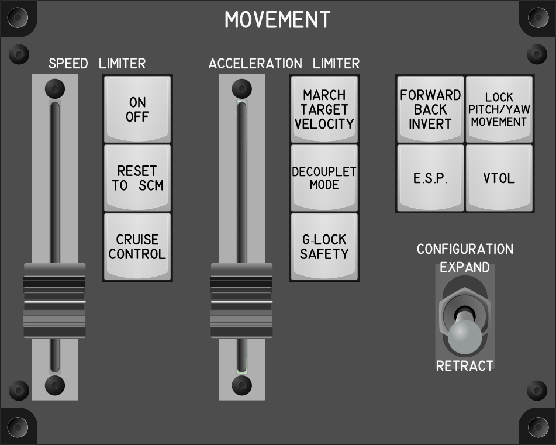

# Movement Module

## Keybindings

| Keybinding                                |  Key / Mouse  | Joy  | Input Device Type     |
| ----------------------------------------- | ------------- | ---- | --------------------- |
| Strafe forward / back Invert              |               | Key  | key[0]                |
| Decouplet mode (toggle)                   | Left Alt + C  | Key  | key[1]                |
| Speed Limiter (Abs.)                      |               | Axis | slide_pot[0]          |
| Speed Limiter - On/Off (Hold/Toggle)      |               | Key  | key[2]                |
| Speed Limiter – Reset to SCM              |               | Key  | key[3]                |
| Acceleration Limiter Up / Down (abs.)     |               | Axis | slide_pot[1]          |
| March target velocity                     |               | Key  | key[4]                |
| Lock Pitch / Yaw movement (toggle / hold) | Right Shift   | Key  | key[5]                |
| G-Lock safety On/Off (Toggle / Hold)      |               | Key  | key[6]                |
| E.S.P. On/Off (Toggle / Hold)             |               | Key  | key[7]                |
| @ui+v_ifcs_esp_hold                       |               | Key  | key[8]                |
| Cruise Control (Toggle)                   | C             | Key  | key[9]                |
| Toggle VTOL                               | K             | Key  | key[10]               |
| Expand Configuration                      |               | Key  | toggle_switch[0]: On  |
| Retract Configuration                     |               | Key  | toggle_switch[0]: Off |

### Total devices in keybindings

| Device               | Count  |
| -------------------- | -----: |
| Keys                 |     11 |
| Toggle switchs       |      1 |
| Encoders             |      0 |
| Slide Pot            |      2 |
| Joystick             |      0 |

## Bill of materials

| Material                                                                                                                                  | Qty. | Links                                                                  |
| ----------------------------------------------------------------------------------------------------------------------------------------- | ---: | ------------------------------------------------------------------------------- |
| Twidec/Heavy Duty Rocker Toggle Switch 16A 250V SPST 2 Position 2 Pin ON/Off Switch with Black PC Wear-Resistant Handle TEN-A-2210BK-A101 |    1 | [Amz](https://www.amazon.com/dp/B07VJ4GQPW)                                     |
| Jade Kailh Box Key Switches                                                                                                               |   10 | [Amz (One Package)](https://www.amazon.com/dp/B09WYV6MTJ), [Amz (One Package)](https://www.amazon.com/dp/B0B9BDM57S) |
| Slide Pot - X-Large (10k Linear Taper)                                                                                                    |    2 | [Sparkfun](https://www.sparkfun.com/slide-pot-x-large-10k-linear-taper.html)     |
| Slide Potentiometer Knob - X-Large                                                                                                        |    2 | [Sparkfun](https://www.sparkfun.com/slide-potentiometer-knob-x-large.html), [Amz](https://www.amazon.com/Electronics123-com-Inc-Slide-Potentiometer-Knob/dp/B01K2BZLA0)   |

## Key labels

[Key Labels](images/ModuleKeyLabels.pdf)
