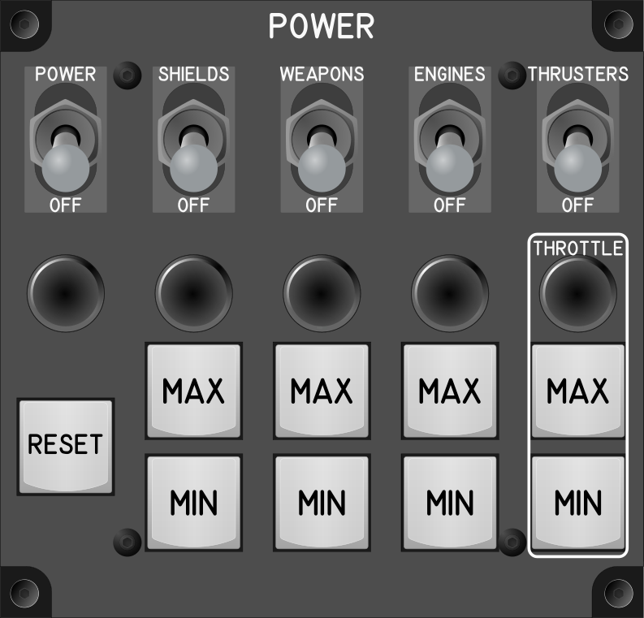

# Modulo de potencia (PowerModule)

El módulo de potencia tiene los controles para la de administración de la
potencia en vuelo como para los de vehículos.

## Keybindings

Los keybindingd a considerar para este módulo pertenecen a dos categorias en SC
`Vehicles – Power Triangle  Assignement` y `Flight – Power`.

### Vehicles – Power Triangle  Assignement

| Keybinding                                                       | Tipo de dispositivo de entrada                    |
| ---------------------------------------------------------------- | ------------------------------------------------- |
| Weapons – Increase (tab)                                         | encoder[0]: increase                           |
| Weapons – Decrease (tab)                                         | encoder[0]: decrease                    |
| Weapons – Set to Max (tab)                                       | key[0]  |
| Weapons – Set to Min (tab)                                       | key[1]      |
| Engines – Increase (tab)                                         | encoder[1]: increase  |
| Engines – Decrease (tab)                                         | encoder[1]: decrease     |
| Engines – Set to Max (tab)                                       | key[2]                       |
| Engines – Set to Min (tab)                                       | key[3]        |
| Shields – Increase (tab)                                         | encoder[2]: increase   |
| Shields – Decrease (tab)                                         | encoder[2]: decrease   |
| Shields – Set to Max (tab)                                       | key[4]             |
| Shields – Set to Min (tab)                                       | key[5]         |
| Reset Assignements                                               | key[6]         |

### Flight – Power

| Keybinding                                                       | Tipo de dispositivo de entrada                    |
| ---------------------------------------------------------------- | ------------------------------------------------- |
| Set Power On                                                     | toggle_switch[0]: on   |
| Set Power Off                                                    | toggle_switch[0]: off        |
| Set Thrusters Power On                                           | toggle_switch[1]: on   |
| Set Thrusters Power Off                                          | toggle_switch[1]: off |
| Set Shields Power On                                             | toggle_switch[2]: on   |
| Set Shields Power Off                                            | toggle_switch[2]: off |
| Set Weapons Power On                                             | toggle_switch[3]: on |
| Set Weapons Power Off                                            | toggle_switch[3]: off |
| Increase Throttle                                                | encoder[3]: increase |
| Decrease Throttle                                                | encoder[3]: decrease |
| Increase Throttle to Max (double tab)                            | key[7] |
| Decrease Throttle to Min (double tab)                            | key[8] |

### Total de dispositivos usados en los keybindings

| Dispositivo          | Numero |
| -------------------- | -----: |
| Keys                 |      9 |
| Toggle switchs       |      4 |
| Encoders             |      4 |

### Categorización

La siguiente tabla organiza en dos categorias ortogonales los dispositivos de
entrada. Es una primera aproximación a como deben quedar organizados en el
panel del módulo los dispositivos de entrada.

| Power         | Shields       | Weapons       |    Engines    | Thrusters     | Throttle      |
| :------------ | :-----------: | :-----------: | :-----------: | :-----------: | :-----------: |
| toggle_switch | toggle_switch | toggle_switch | toggle_switch | toggle_switch |               |
|               | encoder       | encoder       | encoder       |               | encoder       |
|               | key (Max)     | key (Max)     | key (Max)     |               | key (Max)     |
|               | key (Min)     | key (Min)     | key (Min)     |               | key (Min)     |
| key (reset)   |               |               |               |               |               |

## Diseño

### Consideraciones

1. Las columnas `Thrusters` y `Throttle` se fusionaron en una, pero
   marcando la diferencia entre un grupo y otro.
1. La tecla de `reset` se integra a la matriz principal de teclas debajo
   del `toggle_switch` del power.

## Componentes y procesos

Inventario de componentes y procesos para armar el módulo.

| Componente o proceso                         | Cantidad |
| -------------------------------------------- | -------: |
| Keys                                         |        9 |
| Toggle switchs                               |        4 |
| Encoders                                     |        4 |
| Microcontrolador                             |        1 |
| Cable USB                                    |        1 |
| Acrilico negro                               |        1 |
| Acrilico blanco                              |        1 |
| Acrilico translucido                         |        1 |
| Tornillos allen M3 cabeza del botón negros   |       ?? |
| Tornillos allen M3 cabeza de enchufe negros  |        4 |
| Standoff M3                                  |       ?? |
| Tuercas Makerbeam                            |        4 |
| Cables de colores para soldar                |       ?? |
| Termiencogible de colores                    |       ?? |
| Terminales para prensar los toggle switch    |       ?? |
| Lata de pintura negra de acrilico            |        1 |
| Pegante para acrilico                        |        1 |
| Corte laser para los acrilicos               |        3 |
| Grabado laser                                |        1 |
