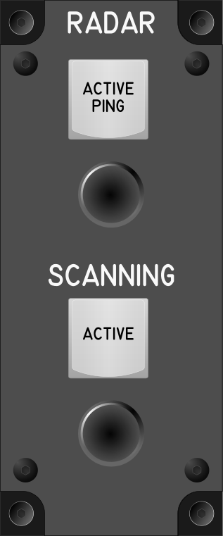

# Módulo de Radar y Scanning (Radar Scanning Module)

## Keybindings

### Flight Radar

| Keybinding                                                       | Tipo de dispositivo de entrada                    |
| ---------------------------------------------------------------- | ------------------------------------------------- |
| Active Ping                                                      | key[0]                                            |
| Increase Pin Angle                                               | encoder[0]: increase                              |
| Decrease Pin Angle                                               | ancoder[0]: decrease                              |

### Vehicles – Scanning

| Keybinding                                                       | Tipo de dispositivo de entrada                    |
| ---------------------------------------------------------------- | ------------------------------------------------- |
| Activate Scanning                                                | key[1]                                            |
| Increase Scanning Angle                                          | encoder[1]: increase                              |
| Decrease Scanning Angle                                          | encoder[1]: decrease                              |

### Total de dispositivos usados en los keybindings

| Dispositivo          | Numero |
| -------------------- | -----: |
| Keys                 |      2 |
| Toggle switchs       |      0 |
| Encoders             |      2 |
