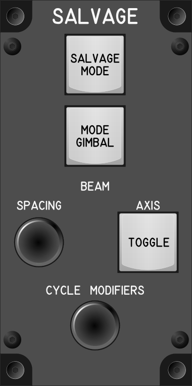

# Salvage Module

## Keybindings

### Vehicles – Seats and Operator Modes

| Keybinding            |  Key / Mouse       | Joy  | Input Device Type     |
| --------------------- | ------------------ | ---- | --------------------- |
| Salvage Mode (Toggle) | M                  | Key  | key[0]                |

### [PH] Vehicles – Salvage

| Keybinding                    |  Key / Mouse                | Joy  | Input Device Type     |
| ----------------------------- | --------------------------- | ---- | --------------------- |
| Salvage Model Gimbal (Toggle) | G                           | Key  | key[0]                |
| Increase Beam Spacing         |                             | Key  | encoder[0]: increase  |
| Decrease Beam Spacing         |                             | Key  | encoder[0]: decrease  |
| Relative Beam Spacing         | Left Alt + Mouse Wheel      | Axis | encoder[1]            |
| Absolute Beam Spacing         |                             | Axis | slide_pot[0]          |
| Salvage Beam Axis (Toggle)    | Left Alt + Buttom 2 (mouse) | Key  | key[1]                |
| Cycle Left Salvage Modifiers  | Buttom 2 (mouse)            | Key  | encoder[1]: increase  |
| Cycle Right Salvage Modifiers | Buttom 2 (mouse)            | Key  | encoder[1]: decrease  |

### Total devices in keybindings

| Device                    | Count  |
| ------------------------- | -----: |
| Keys                      |      2 |
| Toggle switchs            |      0 |
| Rotary 3 position switchs |      0 |
| Encoders                  |      1 |
| Slide                     |      0 |
| Joystick                  |      0 |
