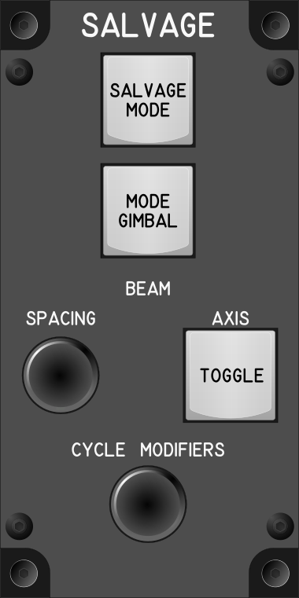

# Salvage Module

## Keybindings

### Vehicles – Seats and Operator Modes

| Keybinding            |  Key / Mouse       | Joy  | Input Device Type     |
| --------------------- | ------------------ | ---- | --------------------- |
| Salvage Mode (Toggle) | M                  | Key  | key[0]                |

### [PH] Vehicles – Salvage

| Keybinding                    |  Key / Mouse                | Joy  | Input Device Type     |
| ----------------------------- | --------------------------- | ---- | --------------------- |
| Salvage Model Gimbal (Toggle) | G                           | Key  | key[0]                |
| Increase Beam Spacing         |                             | Key  | encoder[0]: increase  |
| Decrease Beam Spacing         |                             | Key  | encoder[0]: decrease  |
| Relative Beam Spacing         | Left Alt + Mouse Wheel      | Axis | encoder[1]            |
| Absolute Beam Spacing         |                             | Axis | slide_pot[0]          |
| Salvage Beam Axis (Toggle)    | Left Alt + Buttom 2 (mouse) | Key  | key[1]                |
| Cycle Left Salvage Modifiers  | Buttom 2 (mouse)            | Key  | encoder[1]: increase  |
| Cycle Right Salvage Modifiers | Buttom 2 (mouse)            | Key  | encoder[1]: decrease  |

### Total devices in keybindings

| Device                    | Count  |
| ------------------------- | -----: |
| Keys                      |      2 |
| Toggle switchs            |      0 |
| Rotary 3 position switchs |      0 |
| Encoders                  |      1 |
| Slide                     |      0 |
| Joystick                  |      0 |

## Bill of materials

| Material                                                                                                                                  | Qty. | Links                                                                  |
| ----------------------------------------------------------------------------------------------------------------------------------------- | ---: | ------------------------------------------------------------------------------- |
| (7 Pin 20MM)10 PCS 360 Degree EC11 Rotary Encoder Code Switch Digital Potentiometer with Caps                                             |    2 | [Amz](https://www.amazon.com/dp/B08BFJ4F5C)                                     |
| Jade Kailh Box Key Switches                                                                                                               |    3 | [Amz (One Package)](https://www.amazon.com/dp/B09WYV6MTJ), [Amz (One Package)](https://www.amazon.com/dp/B0B9BDM57S) |3-com-Inc-Slide-Potentiometer-Knob/dp/B01K2BZLA0)   |
| Teensy 4.0                                                                                                                                |    1 | [Amz](https://www.amazon.com/dp/B07W5J3WNH)                                     |
| Terminal Block Breakout Board Module for Teensy 4.0, Screw Mount Version                                                                  |    1 | [Amz](https://www.amazon.com/dp/B08R7PVCFN)                                     |
| Female to Female Thread Spacer Screws Brass Hex Standoff M3 x 60mm                                                                        |    4 | [Amz](https://www.amazon.com/dp/B09V272N1N)                                     |
| 3Mx6 Socket Head Cap Bolts                                                                                                                |    4 | 1 package[Amz](https://www.amazon.com/dp/B00W8YSCIS)                            |
| 3M Flat Washers                                                                                                                           |    8 | In one package [Amz](https://www.amazon.com/dp/B08CHHLQQS)                      |
| 3Mx12 Button Head Socket Cap Bolts                                                                                                        |    2 | In one package [Amz](https://www.amazon.com/dp/B08CHHLQQS)                      |
| 3Mx5 Button Head Socket Cap Bolts                                                                                                         |    4 | In one package [Amz](https://www.amazon.com/dp/B08CHHLQQS)                      |
| Plastic Primer                                                                                                                            |    1 | [mtn](https://www.montanacolors.com/en/productos/mtn-pro-plastic-primer-spray/) |
| Black Matte Paint R-9011                                                                                                                  |    1 | [mtn](https://www.montanacolors.com/en/productos/mtn-94-aerosol-spray-paint/)   |
| 2mm white acrylic                                                                                                                         |    1 |                                                                                 |
| 3mm translucent acrylic                                                                                                                   |    1 |                                                                                 |
| 3mm black acrylic                                                                                                                         |    1 |                                                                                 |
| 3mm black acrylic                                                                                                                         |    1 |                                                                                 |

## Key labels

[Key Labels](images/ModuleKeyLabels.pdf)
