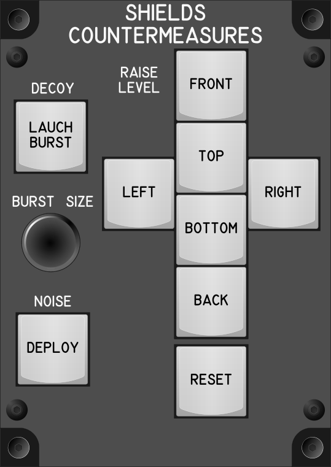

# Shields and Countermeasures Module

## Keybindings

### Vehicles – Targeting

| Keybinding                                             | Input Device Type    |
| ------------------------------------------------------ | -------------------- |
| Shield Raise level front                               | key[0]               |
| Shield Raise level back                                | key[1]               |
| Shield Raise level left                                | key[2]               |
| Shield Raise level right                               | key[3]               |
| Shield Raise level top                                 | key[4]               |
| Shield Raise level bottom                              | key[5]               |
| Shield reset levels                                    | key[6]               |
| Decoy – Lauch Burst (tab), Set and Launch Burst (hold) | key[7]               |
| Decoy – Increase Burst Size (tab)                      | encoder[0]: increase |
| Decoy – Increase Burst Size (tab)                      | encoder[0]: decrease |
| Noise – Deploy (tab)                                   | key[8]               |

### Total devices in keybindings

| Device               | Count  |
| -------------------- | -----: |
| Keys                 |      9 |
| Toggle switchs       |      0 |
| Encoders             |      1 |
| Slide                |      0 |
| Joystick             |      0 |
