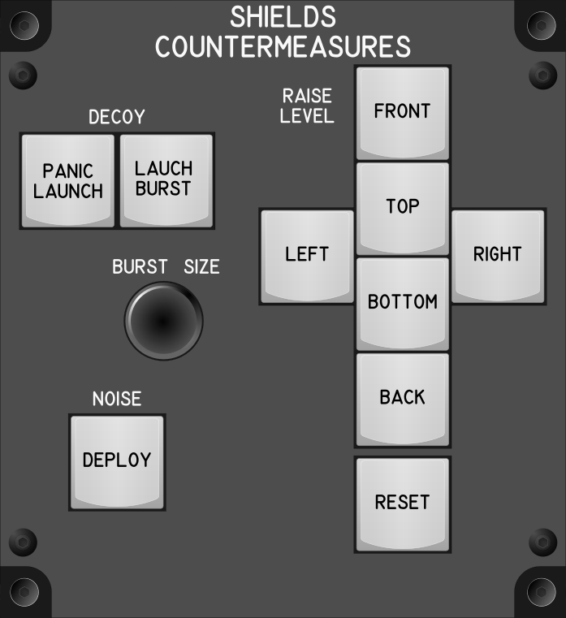

# Shields and Countermeasures Module

## Keybindings

### Vehicles – Shields and Countermeasures

| Keybinding                                             | Input Device Type    |
| ------------------------------------------------------ | -------------------- |
| Shield Raise level front                               | key[0]               |
| Shield Raise level back                                | key[1]               |
| Shield Raise level left                                | key[2]               |
| Shield Raise level right                               | key[3]               |
| Shield Raise level top                                 | key[4]               |
| Shield Raise level bottom                              | key[5]               |
| Shield reset levels                                    | key[6]               |
| Decoy – Lauch Burst (tab), Set and Launch Burst (hold) | key[7]               |
| Decoy – Increase Burst Size (tab)                      | encoder[0]: increase |
| Decoy – Increase Burst Size (tab)                      | encoder[0]: decrease |
| Decoy – Panic Launch (tab)                             | key[8]               |
| Noise – Deploy (tab)                                   | key[9]               |

### Total devices in keybindings

| Device               | Count  |
| -------------------- | -----: |
| Keys                 |     10 |
| Toggle switchs       |      0 |
| Encoders             |      1 |
| Slide                |      0 |
| Joystick             |      0 |

## Bill of materials

| Material                                                                                                                                  | Qty. | Links                                                                  |
| ----------------------------------------------------------------------------------------------------------------------------------------- | ---: | ------------------------------------------------------------------------------- |
| (7 Pin 20MM)10 PCS 360 Degree EC11 Rotary Encoder Code Switch Digital Potentiometer with Caps                                             |    1 | [Amz](https://www.amazon.com/dp/B08BFJ4F5C)                                     |
| Jade Kailh Box Key Switches                                                                                                               |   10 | [Amz (One Package)](https://www.amazon.com/dp/B09WYV6MTJ), [Amz (One Package)](https://www.amazon.com/dp/B0B9BDM57S) |3-com-Inc-Slide-Potentiometer-Knob/dp/B01K2BZLA0)   |

## Key labels

[Key Labels](images/ModuleKeyLabels.pdf)
