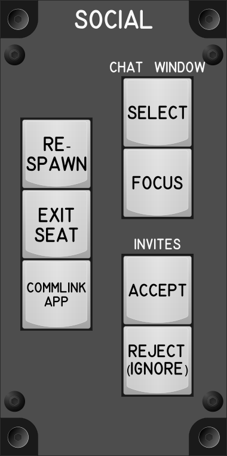

# Social Module

## Keybindings

### Social – General

| Keybinding            | Key / Mouse | Joy | Input Device Type      |
| --------------------- | ----------- | --- | ---------------------- |
| Re-spawn              | X           | Key | key[0] (Joystick)      |
| Exit seat             | Y           | Key | key[1] (Joystick)      |
| CommLink App (toggle) | F11         | Key | key[2] (Joystick)      |
| Chat Window (toggle)  | F12         | Key | key[3] (Joystick)      |
| Chat Window Focus     | Return      | Key | key[4] (Joystick)      |

### Social – Invites

| Keybinding           | Key / Mouse   | Joy | Input Device Type      |
| -------------------- | ------------- | --- | ---------------------- |
| Accept Invite        | Left Bracket  |     | key[5] (Keyboard)      |
| Reject Invite        | Right Bracket |     | key[6] (Keyboard) [^1] |
| Ignore Invite (Hold) | Right Bracket |     | key[6] (Keyboard) [^1] |

[^1]: The same key can be used.     

### Total devices in keybindings

| Device                |  Count |
| --------------------- | -----: |
| Keys                  |      7 |
| Toggle switchs        |      0 |
| Toggle switchs (hold) |      0 |
| Slide Pot             |      0 |
| Encoders              |      0 |
| Slide Pot             |      0 |
| Joystick              |      0 |
