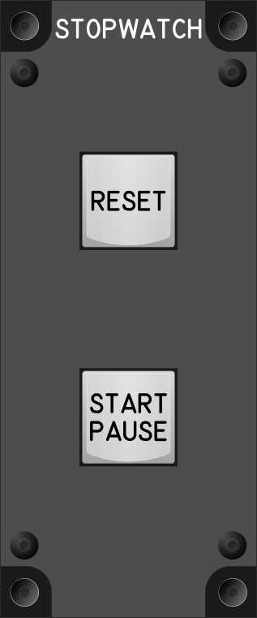

# Stopwatch Module

## Keybindings

### Stop Watch

| Keybinding                    |  Key / Mouse   | Joy  | Input Device Type     |
| ----------------------------- | -------------- | ---- | --------------------- |
| Reset (Long Press)            |                | Key  | key[0]                |
| Start / Pause (Short Press)   |                | Key  | key[1]                |

### Total devices in keybindings

| Device                    | Count  |
| ------------------------- | -----: |
| Keys                      |      2 |
| Toggle switchs            |      0 |
| Rotary 3 position switchs |      0 |
| Encoders                  |      0 |
| Slide                     |      0 |
| Joystick                  |      0 |
