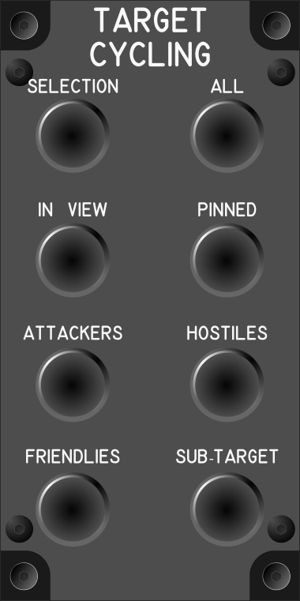

# Target Cycling Module

## Keybindings

### Vehicles – Targeting

| Keybinding                                     |  Key / Mouse | Joy | Input Device Type     |
| ---------------------------------------------- | ------------ | --- | --------------------- |
| Cycle Selection – Back                         |              | Key | encoder[0]: decrement |
| Cycle Selection – Forward                      | R            | Key | encoder[0]: increment |
| Cycle Selection – Reset to Auto                | Left Alt + R | Key | encoder[0]: push      |
| Cycle Lock – In View – Back                    |              | Key | encoder[1]: decrement |
| Cycle Lock – In View – Forward                 | T            | Key | encoder[1]: increment |
| Cycle Lock – In View – Under Reticle           | T            | Key | encoder[1]: push      |
| Cycle Lock – Pinned – Back                     |              | Key | encoder[2]: decrement |
| Cycle Lock – Pinned – Forward                  |              | Key | encoder[2]: increment |
| Cycle Lock – Pinned – Reset to First           |              | Key | encoder[2]: push      |
| Cycle Lock – Attackers – Back                  |              | Key | encoder[3]: decrement |
| Cycle Lock – Attackers – Forward               | 4            | Key | encoder[3]: increment |
| Cycle Lock – Attackers – Reset to Closest      | Left Alt + 4 | Key | encoder[3]: push      |
| Cycle Lock – Hostiles – Back                   |              | Key | encoder[4]: decrement |
| Cycle Lock – Hostiles – Forward                | 5            | Key | encoder[4]: increment |
| Cycle Lock – Hostiles – Reset to Closest       | Left Alt + 5 | Key | encoder[4]: push      |
| Cycle Lock – Friendlies – Back                 |              | Key | encoder[5]: decrement |
| Cycle Lock – Friendlies – Forward              | 6            | Key | encoder[5]: increment |
| Cycle Lock – Friendlies – Reset to Closest     | Left Alt + 6 | Key | encoder[5]: push      |
| Cycle Lock – All – Back                        |              | Key | encoder[6]: decrement |
| Cycle Lock – All – Forward                     | 7            | Key | encoder[6]: increment |
| Cycle Lock – All – Reset to Closest            | Left Alt + 7 | Key | encoder[6]: push      |
| Cycle Lock – Sub-Target – Back                 |              | Key | encoder[7]: decrement |
| Cycle Lock – Sub-Target – Forward              | 8            | Key | encoder[7]: increment |
| Cycle Lock – Sub-Target – Reset to Main Target | Left Alt + 8 | Key | encoder[7]: push      |

### Total devices in keybindings

| Device                |  Count |
| --------------------- | -----: |
| Keys                  |      0 |
| Toggle switchs        |      0 |
| Toggle switchs (hold) |      0 |
| Slide Pot             |      0 |
| Encoders              |      8 |
| Slide Pot             |      0 |
| Joystick              |      0 |
