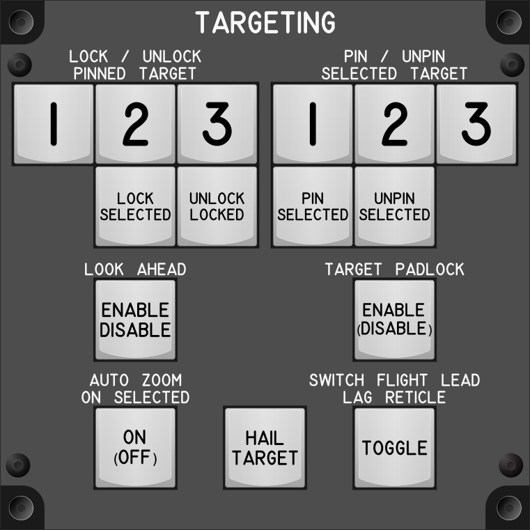

# Targeting Module

## Keybindings

### Vehicles – Targeting

| Keybinding                                           |  Key / Mouse | Joy | Input Device Type     |
| ---------------------------------------------------- | ------------ | --- | --------------------- |
| Pin Index 1 – Lock / Unlock Pinned Target            | 1            | Key | key[0] (Joystick)     |
| Pin Index 2 – Lock / Unlock Pinned Target            | 2            | Key | key[1] (Joystick)     |
| Pin Index 3 – Lock / Unlock Pinned Target            | 3            | Key | key[2] (Joystick)     |
| Pin Index 1 – Pin / Unpin Selected Target            | Left Alt + 1 | Key | key[3] (Joystick)     |
| Pin Index 2 – Pin / Unpin Selected Target            | Left Alt + 2 | Key | key[4] (Joystick)     |
| Pin Index 3 – Pin / Unpin Selected Target            | Left Alt + 3 | Key | key[5] (Joystick)     |
| Pin Selected Target                                  |              | Key | key[6] (Joystick)     |
| Unpin Selected Target                                |              | Key | key[7] (Joystick)     |
| Remove All Pinned Targets                            | 0            | Key | key[8] (Joystick)     |
| Lock Selected Target                                 |              | Key | key[9] (Joystick)     |
| Unlock Locked Target                                 | Left Alt + T | Key | key[10] (Joystick)    |
| Enable / Disable Look Ahead                          | Left Alt + L | Key | key[11] (Joystick)    |
| Enable / Disable Target Padlock (toggle, hold)       |              | Key | key[12] (Joystick)    |
| Auto Zoom On Selected Target On / Off (Toggle, Hold) |              | Key | key[13] (Joystick)    |
| Switch Flight Lead / Lag Reticle (Toggle)            |              |     | key[14] (Keyboard)    |

### Target Hailing

| Keybinding                                           |  Key / Mouse | Joy | Input Device Type     |
| ---------------------------------------------------- | ------------ | --- | --------------------- |
| Hail Target                                          | 9            | Key | key[15] (Joystick)    |

### Total devices in keybindings

| Device                |  Count |
| --------------------- | -----: |
| Keys                  |     16 |
| Toggle switchs        |      0 |
| Toggle switchs (hold) |      0 |
| Slide Pot             |      0 |
| Encoders              |      0 |
| Slide Pot             |      0 |
| Joystick              |      0 |
