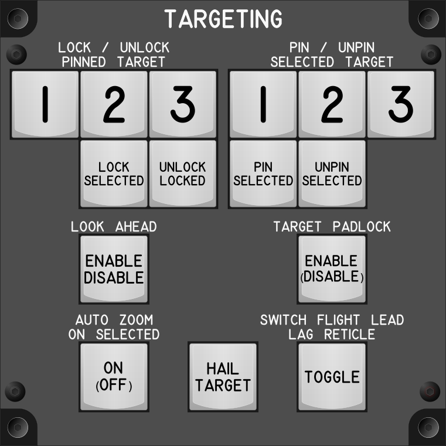

# Targeting Module

## Keybindings

### Vehicles – Targeting

| Keybinding                                           |  Key / Mouse | Joy | Input Device Type     |
| ---------------------------------------------------- | ------------ | --- | --------------------- |
| Pin Index 1 – Lock / Unlock Pinned Target            | 1            | Key | key[0] (Joystick)     |
| Pin Index 2 – Lock / Unlock Pinned Target            | 2            | Key | key[1] (Joystick)     |
| Pin Index 3 – Lock / Unlock Pinned Target            | 3            | Key | key[2] (Joystick)     |
| Pin Index 1 – Pin / Unpin Selected Target            | Left Alt + 1 | Key | key[3] (Joystick)     |
| Pin Index 2 – Pin / Unpin Selected Target            | Left Alt + 2 | Key | key[4] (Joystick)     |
| Pin Index 3 – Pin / Unpin Selected Target            | Left Alt + 3 | Key | key[5] (Joystick)     |
| Pin Selected Target                                  |              | Key | key[6] (Joystick)     |
| Unpin Selected Target                                |              | Key | key[7] (Joystick)     |
| Remove All Pinned Targets                            | 0            | Key | key[8] (Joystick)     |
| Lock Selected Target                                 |              | Key | key[9] (Joystick)     |
| Unlock Locked Target                                 | Left Alt + T | Key | key[10] (Joystick)    |
| Enable / Disable Look Ahead                          | Left Alt + L | Key | key[11] (Joystick)    |
| Enable / Disable Target Padlock (toggle, hold)       |              | Key | key[12] (Joystick)    |
| Auto Zoom On Selected Target On / Off (Toggle, Hold) |              | Key | key[13] (Joystick)    |
| Switch Flight Lead / Lag Reticle (Toggle)            |              |     | key[14] (Keyboard)    |

### Target Hailing

| Keybinding                                           |  Key / Mouse | Joy | Input Device Type     |
| ---------------------------------------------------- | ------------ | --- | --------------------- |
| Hail Target                                          | 9            | Key | key[15] (Joystick)    |

### Total devices in keybindings

| Device                |  Count |
| --------------------- | -----: |
| Keys                  |     16 |
| Toggle switchs        |      0 |
| Toggle switchs (hold) |      0 |
| Slide Pot             |      0 |
| Encoders              |      0 |
| Slide Pot             |      0 |
| Joystick              |      0 |

## Bill of materials

| Material                                                                                                                                  | Qty. | Links                                                                  |
| ----------------------------------------------------------------------------------------------------------------------------------------- | ---: | ------------------------------------------------------------------------------- |
| Jade Kailh Box Key Switches                                                                                                               |   15 | [Amz (One Package)](https://www.amazon.com/dp/B09WYV6MTJ), [Amz (One Package)](https://www.amazon.com/dp/B0B9BDM57S) |3-com-Inc-Slide-Potentiometer-Knob/dp/B01K2BZLA0)   |
| Teensy 4.0                                                                                                                                |    1 | [Amz](https://www.amazon.com/dp/B07W5J3WNH)                                     |
| Terminal Block Breakout Board Module for Teensy 4.0, Screw Mount Version                                                                  |    1 | [Amz](https://www.amazon.com/dp/B08R7PVCFN)                                     |
| Female to Female Thread Spacer Screws Brass Hex Standoff M3 x 60mm                                                                        |    4 | [Amz](https://www.amazon.com/dp/B09V272N1N)                                     |
| 3Mx6 Socket Head Cap Bolts                                                                                                                |    4 | 1 package[Amz](https://www.amazon.com/dp/B00W8YSCIS)                            |
| 3M Flat Washers                                                                                                                           |    8 | In one package [Amz](https://www.amazon.com/dp/B08CHHLQQS)                      |
| 3Mx12 Button Head Socket Cap Bolts                                                                                                        |    2 | In one package [Amz](https://www.amazon.com/dp/B08CHHLQQS)                      |
| 3Mx5 Button Head Socket Cap Bolts                                                                                                         |    4 | In one package [Amz](https://www.amazon.com/dp/B08CHHLQQS)                      |
| Plastic Primer                                                                                                                            |    1 | [mtn](https://www.montanacolors.com/en/productos/mtn-pro-plastic-primer-spray/) |
| Black Matte Paint R-9011                                                                                                                  |    1 | [mtn](https://www.montanacolors.com/en/productos/mtn-94-aerosol-spray-paint/)   |
| 2mm white acrylic                                                                                                                         |    1 |                                                                                 |
| 3mm translucent acrylic                                                                                                                   |    1 |                                                                                 |
| 3mm black acrylic                                                                                                                         |    1 |                                                                                 |
| 3mm black acrylic                                                                                                                         |    1 |                                                                                 |

## Connections

## Key labels

[Key Labels](images/ModuleKeyLabels.pdf)

