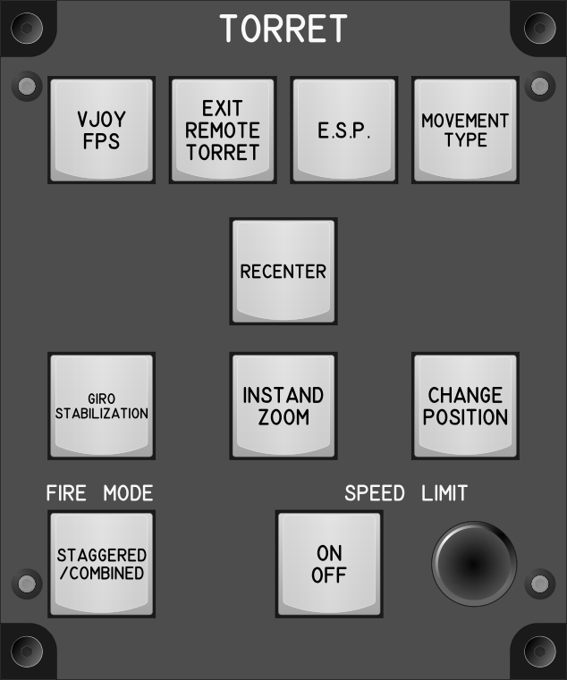

# Torret Module

## Keybindings

### Torret Movement

| Keybinding                                     | Input Device Type |
| ---------------------------------------------- | ----------------- |
| Toggle Torret Mouse Movement (Vjoy, FPS style) | key[0]            |
| Exit Remote Torret                             | key[1]            |

### Turret Advanced

| Keybinding                                  | Input Device Type    |
| ------------------------------------------- | -------------------- |
| Toggle E.S.P.  On/Off                       | key[2]               |
| Recenter Turret                             | key[3]               |
| Turret Giro Stabilization (Toggle)          | key[4]               |
| Turret Speed Limit On / Off (Toggle / Hold) | key[5]               |
| [PH] Turret Speed Limiter  Increase (rel.)  | encoder[0]: increase |
| [PH] Turret Speed Limiter  Decrease (rel.)  | encoder[0]: decrease |
| Cycle Fire Mode (staggered / combined)      | key[6]               |
| Change prefered movement type               | key[7]               |
| @ui_CI_InstandZoom                          | key[8]               |
| @ui_ci_turret_change_position               | key[9]               |

### Total devices in keybindings

| Device               |  Count |
| -------------------- | -----: |
| Keys                 |     10 |
| Toggle switchs       |      0 |
| Encoders             |      1 |
| Slide                |      0 |
| Joysticks            |      0 |

## Bill of materials

| Material                                                                                                                                  | Qty. | Links                                                                  |
| ----------------------------------------------------------------------------------------------------------------------------------------- | ---: | ------------------------------------------------------------------------------- |
| (7 Pin 20MM)10 PCS 360 Degree EC11 Rotary Encoder Code Switch Digital Potentiometer with Caps                                             |    1 | [Amz](https://www.amazon.com/dp/B08BFJ4F5C)                                     |
| Jade Kailh Box Key Switches                                                                                                               |   10 | [Amz (One Package)](https://www.amazon.com/dp/B09WYV6MTJ), [Amz (One Package)](https://www.amazon.com/dp/B0B9BDM57S) |3-com-Inc-Slide-Potentiometer-Knob/dp/B01K2BZLA0)   |

## Key labels

[Key Labels](images/ModuleKeyLabels.pdf)

