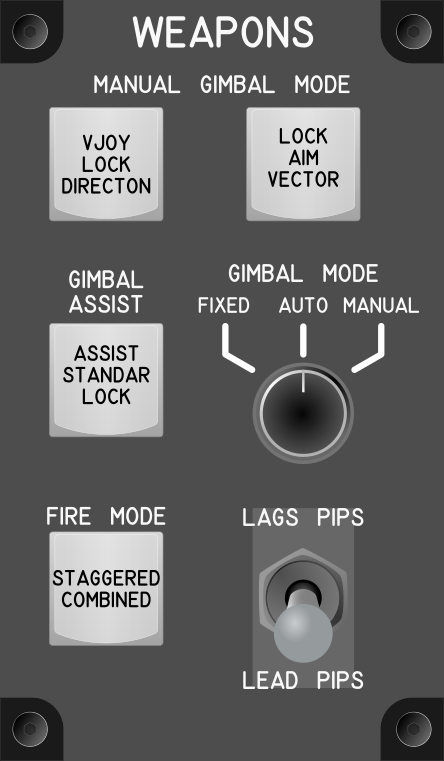

# Weapons Module

## Keybindings

### Vehicles - Weapons

| Keybinding                                                     |  Key / Mouse  | Joy  | Input Device Type     |
| -------------------------------------------------------------- | ------------- | ---- | --------------------- |
| Manual Gimbal Mode – Swap Vjoy / Lock Directon (Toggle / Hold) | Left Alt+ G   | Key  | key[0]                |
| Manual Gimbal Mode – Lock Aim Vector                           | Right Alt + G | Key  | key[1]                |
| Cycle Gimbal Assist / Standar Gimbal / Gimbal Lock modes       |               | Key  | key[2]                |
| Set Fixed Gimbal Mode (Short Press)                            |               | Key  | multiple_switch[0]    |
| Set Auto Gimbal Mode (short Press)                             |               | Key  | multiple_switch[0]    |
| Set Manual Gimbal Mode (Short Press)                           |               | Key  | multiple_switch[0]    |
| Cycle Fire Mode (Staggered / Combined)                         |               | Key  | key[3]                |
| Set Lags PIPs                                                  |               | Key  | toggle_switch[0]: On  |
| Set Lead PIPs                                                  |               | Key  | toggle_switch[0]: Off |

### Total devices in keybindings

| Device               | Count  |
| -------------------- | -----: |
| Keys                 |      4 |
| Toggle switchs       |      1 |
| Multiple switchs     |      1 |
| Encoders             |      0 |
| Slide                |      0 |
| Joystick             |      0 |
