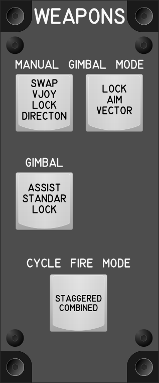

# Weapons Module

## Keybindings

| Keybinding                                                     | Input Device Type |
| -------------------------------------------------------------- | ----------------- |
| Manual Gimbal Mode – Swap Vjoy / Lock Directon (Toggle / Hold) | key[0]            |
| Manual Gimbal Mode – Lock Aim Vector                           | key[1]            |
| Cycle Gimbal Assist / Standar Gimbal / Gimbal Lock modes       | key[2]            |
| Cycle Fire Mode (Staggered / Combined)                         | key[3]            |

### Total devices in keybindings

| Device               | Count  |
| -------------------- | -----: |
| Keys                 |      4 |
| Toggle switchs       |      0 |
| Encoders             |      0 |
| Slide                |      0 |
| Joystick             |      0 |
