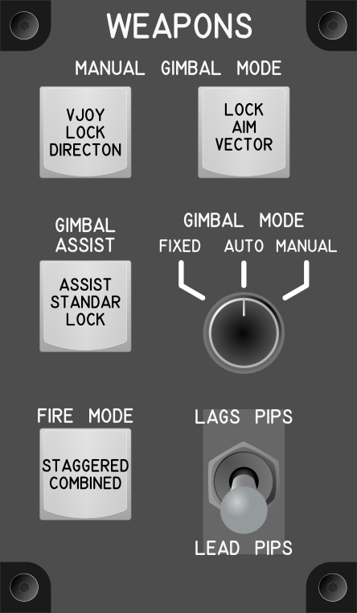

# Weapons Module

## Keybindings

### Vehicles - Weapons

| Keybinding                                                     |  Key / Mouse  | Joy  | Input Device Type     |
| -------------------------------------------------------------- | ------------- | ---- | --------------------- |
| Manual Gimbal Mode – Swap Vjoy / Lock Directon (Toggle / Hold) | Left Alt+ G   | Key  | key[0]                |
| Manual Gimbal Mode – Lock Aim Vector                           | Right Alt + G | Key  | key[1]                |
| Cycle Gimbal Assist / Standar Gimbal / Gimbal Lock modes       |               | Key  | key[2]                |
| Set Fixed Gimbal Mode (Short Press)                            |               | Key  | multiple_switch[0]    |
| Set Auto Gimbal Mode (short Press)                             |               | Key  | multiple_switch[0]    |
| Set Manual Gimbal Mode (Short Press)                           |               | Key  | multiple_switch[0]    |
| Cycle Fire Mode (Staggered / Combined)                         |               | Key  | key[3]                |
| Set Lags PIPs                                                  |               | Key  | toggle_switch[0]: On  |
| Set Lead PIPs                                                  |               | Key  | toggle_switch[0]: Off |

### Total devices in keybindings

| Device               | Count  |
| -------------------- | -----: |
| Keys                 |      4 |
| Toggle switchs       |      1 |
| Multiple switchs     |      1 |
| Encoders             |      0 |
| Slide                |      0 |
| Joystick             |      0 |

## Bill of materials

| Material                                                                                                                                       | Qty. | Links                                                                  |
| ---------------------------------------------------------------------------------------------------------------------------------------------- | ---: | ------------------------------------------------------------------------------- |
| Twidec/Heavy Duty Rocker Toggle Switch 16A 250V SPST 2 Position 2 Pin ON/Off Switch with Black PC Wear-Resistant Handle TEN-A-2210BK-A101      |    1 | [Amz](https://www.amazon.com/dp/B07VJ4GQPW)                                     |
| Jade Kailh Box Key Switches                                                                                                                    |    4 | [Amz (One Package)](https://www.amazon.com/dp/B09WYV6MTJ), [Amz (One Package)](https://www.amazon.com/dp/B0B9BDM57S) |
| 10PCS SR16 Plastic 16MM Rotary Band Switch 2 Pole 3 4 Position 1 Pole 5 6 8 Position Handle Length 15MM Axis Band Switch (Color : 2 Pole 3)    |    1 | [Amz](https://www.amazon.com/dp/B0BRF8YTW8)                                     |
| Teensy 4.0                                                                                                                                |    1 | [Amz](https://www.amazon.com/dp/B07W5J3WNH)                                     |
| Terminal Block Breakout Board Module for Teensy 4.0, Screw Mount Version                                                                  |    1 | [Amz](https://www.amazon.com/dp/B08R7PVCFN)                                     |
| Female to Female Thread Spacer Screws Brass Hex Standoff M3 x 60mm                                                                        |    4 | [Amz](https://www.amazon.com/dp/B09V272N1N)                                     |
| 3Mx6 Socket Head Cap Bolts                                                                                                                |    4 | 1 package[Amz](https://www.amazon.com/dp/B00W8YSCIS)                            |
| 3M Flat Washers                                                                                                                           |    8 | In one package [Amz](https://www.amazon.com/dp/B08CHHLQQS)                      |
| 3Mx12 Button Head Socket Cap Bolts                                                                                                        |    2 | In one package [Amz](https://www.amazon.com/dp/B08CHHLQQS)                      |
| 3Mx5 Button Head Socket Cap Bolts                                                                                                         |    4 | In one package [Amz](https://www.amazon.com/dp/B08CHHLQQS)                      |
| Plastic Primer                                                                                                                            |    1 | [mtn](https://www.montanacolors.com/en/productos/mtn-pro-plastic-primer-spray/) |
| Black Matte Paint R-9011                                                                                                                  |    1 | [mtn](https://www.montanacolors.com/en/productos/mtn-94-aerosol-spray-paint/)   |
| 2mm white acrylic                                                                                                                         |    1 |                                                                                 |
| 3mm translucent acrylic                                                                                                                   |    1 |                                                                                 |
| 3mm black acrylic                                                                                                                         |    1 |                                                                                 |
| 3mm black acrylic                                                                                                                         |    1 |                                                                                 |

## Key labels

[Key Labels](images/ModuleKeyLabels.pdf)
