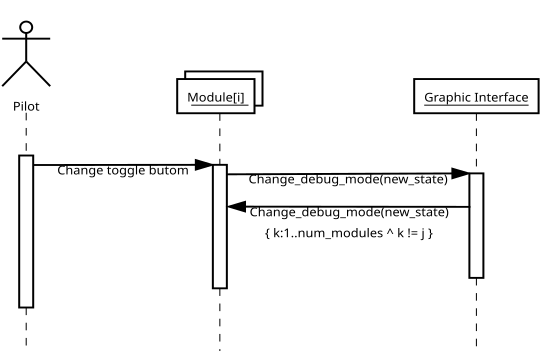
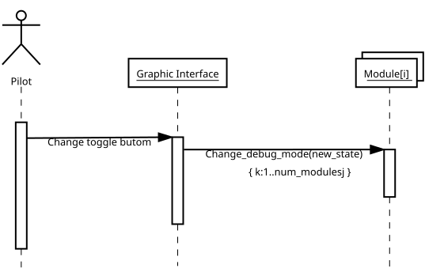
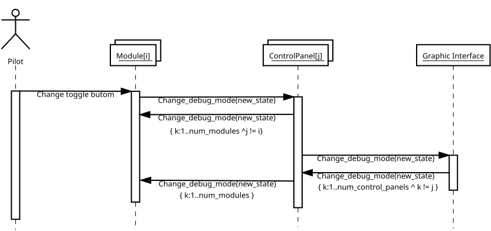
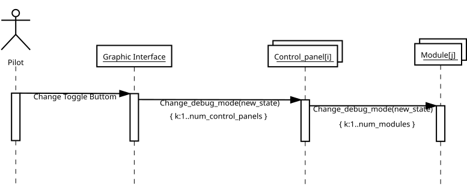
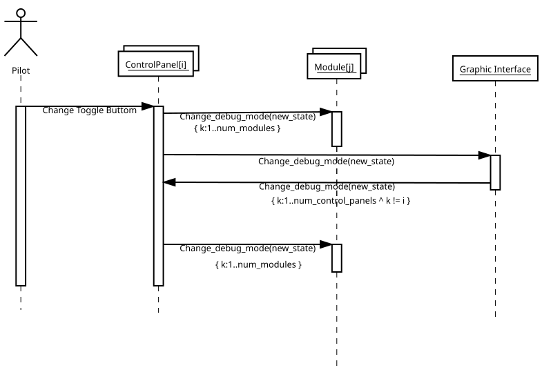

# Protocolo de comunicación por el serial de los modules, controlPanels e interfaz gráfica

Este protocolo se implementa sobre el serial de los módulos y de los paneles de control.

## Mensajes del Module

* Como los módulos pueden conectarse directamente al computador o mediante un ControlPanel los mensajes que le llegan son indiferentes si llegan de la interfaz gráfica o del ControlPanel. Por eso hay una columna en la siguiente tabla en el que disparador puede llegar de la interfa gráfica o del ControlPanel.
* Los mensajes de debug comienzan con una 'D' amyúscula, que viene a ser en byte 0, para diferenciarlos de los otros tipos de mensajes.

| Mensaje                     | Valor Byte 0 | Tipo parámetro | Valor | Disparador en el Module  | Disparador desde el ControlPanel o Interfáz Gráfica | Descripción                                                                                                                                |
| --------------------------- | -----------: | -------------- | ----- | ------------------------ | --------------------------------------------------- | ------------------------------------------------------------------------------------------------------------------------------------------ |
| Change_debug_mode           | 1            | byte           | 0,1   | Toggle Buttom            | Change_debug_mode                                   | Cambia el modo de debug 0 no debug, 1 debug                                                                                                |
| Change_backlight_brightness | 2            | byte           | 0-255 | Potentiometer            | Change_backlight_brightness                         | Cambia el brillo de la retroilumimación                                                                                                    |
| Send_module_name            | 11           | string         |       |                          | Ask_name                                            | Envía el nombre del Module                                                                                                                 |
| Send_number_buttons         | 21           | byte           | 0-128 |                          | Ask_number                                          | Envía el número de botones                                                                                                                 |
| Send_number_axis            | 23           | byte           | 0-128 |                          | Ask_number                                          | Envía el número de ejes                                                                                                                    |
| Send_debug_output           | 'D'          | string         |       |                          | Cambio en el estado de debug a 1                    | Envía mensajes de debug si el debug está activo                                                                                            |

## Mensajes del ControlPanel

* El brillo de los módulos puede ser cambiado desde un módulo, o desde un potenciometro conectado directamente al ControlPanel o desde la Intefaz Gráfica.
* El estado del debug puede ser cambiado desde un módulo, o desde un toggle buttom conectado directamente al Control Panel o desde la Interfaz Gráfica.
* Por lo anterior la Intefáz Gráfica debe tener una parte donde se muestren los mensajes que llegan desde el serial.
* Los mensajes de debug comienzan con una 'D' amyúscula, que viene a ser en byte 0, para diferenciarlos de los otros tipos de mensajes.

| Mensaje                     | Valor Byte 0 | Tipo parámetro | Valor | Disparador en el ControlPanel  | Disparador desde el Module  | Disparador desde la Interfaz Gráfica  | Descripción                                                                                                                                |
| --------------------------- | -----------: | -------------- | ----- | ------------------------------ | --------------------------- | ------------------------------------- | ------------------------------------------------------------------------------------------------------------------------------------------ |
| Change_debug_mode           | 1            | byte           | 0,1   | Toggle Buttom                  | Change_debug_mode           | Change_debug_mode                     | Cambia el modo de debug 0 no debug, 1 debug                                                                                                |
| Change_backlight_brightness | 2            | byte           | 0-255 | Potentiometer                  | Change_backlight_brightness | Change_backlight_brightness           | Cambia el brillo de la retroilumimación de los modules conectados a ControlPanel, o de los controlPanles conectados a la Interfaz Gráfica  |
| Ask_name                    | 10           |                |       | setup()                        |                             | Ask_name                              | Pregunta por el nombre del modulo desde el control panel, o del panel desde la Interfaz Gráfica                                            |
| Send_modules_name           | 12           | string         |       |                                |                             | Ask_name                              | Envía una lista separada por comas de los nombres de los Modules                                                                           |
| Send_control_panel_name     | 13           | string         |       |                                |                             | Ask_module_name                       | Envía el nombre del ControlPanel                                                                                                           |
| Ask_number                  | 20           |                |       | setup()                        |                             | Ask_number                            | Pregunta por el numero de componentes desde el ControlPanel, o número de modules desde la Interfáz Gráfica                                 |
| Send_number_modules         | 12           | byte           | 0-9   |                                |                             | Ask_number                            | Envía el número de modulos coectados a ControlPanel                                                                                        |
| Send_debug_output           | 'D'          | string         |       | Cambio del estado de debug a 1 |                             |                                       | Envía mensajes de debug si el debug está activo                                                                                            |

## Mensajes

### Change_debug_mode

#### Change_debug_mode from Module without Control panel

#### Change_debug_mode from Graphic Interface without Control panel

#### Change_debug_mode from Module

#### Change_debug_mode from Graphic Interface

#### Change_debug_mode from ControlPanel

