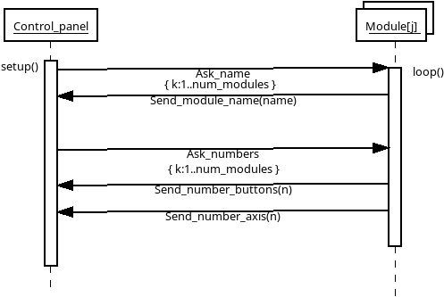
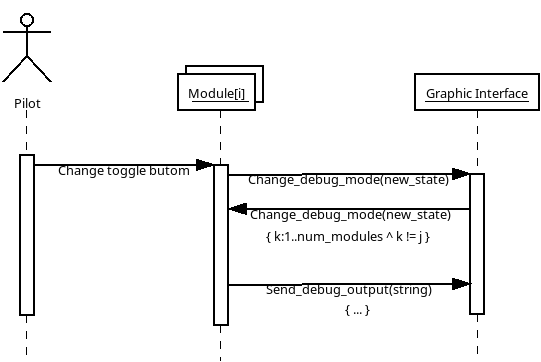
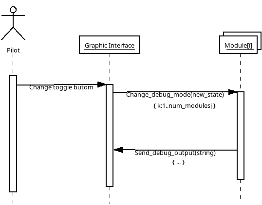
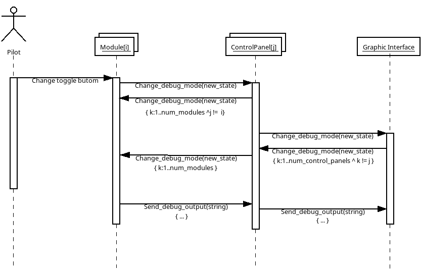
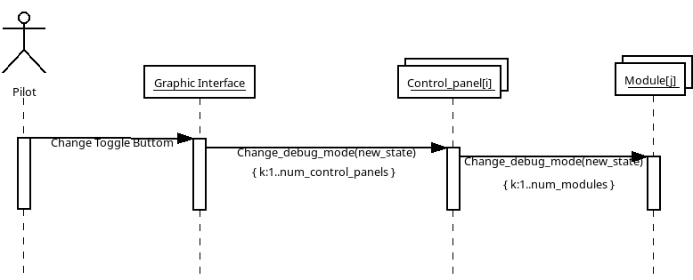
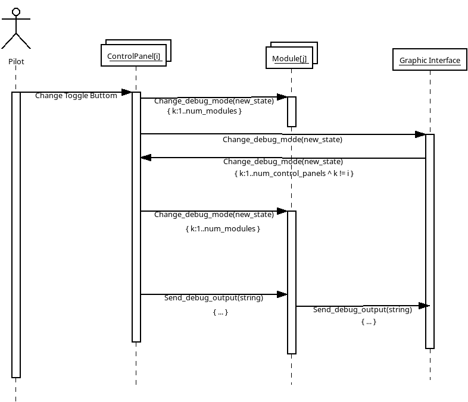
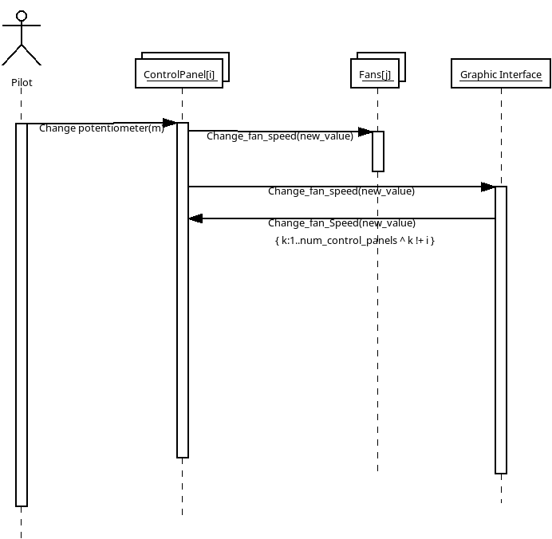
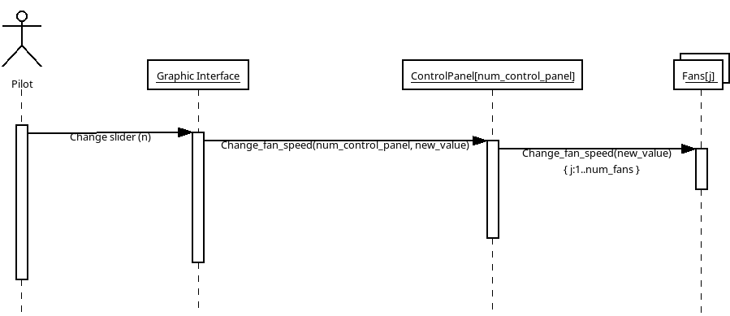
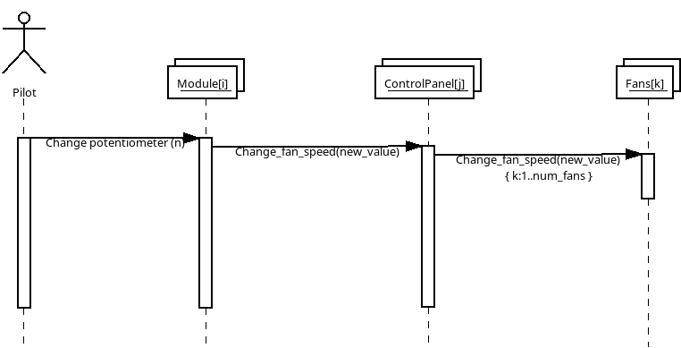
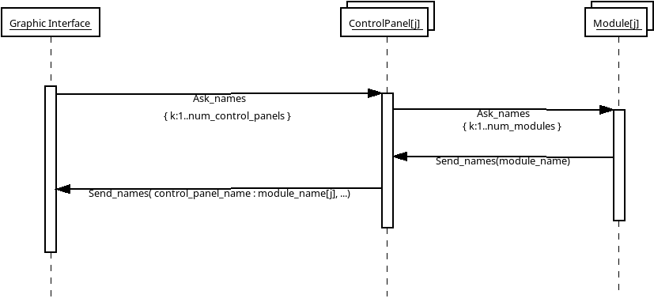

# Serial communication protocol for modules, control panels, and graphical interfaces

This protocol is implemented over the serial port of modules and control panels.

## Module Messages

* Since modules can be connected directly to the computer or through a control panel, the messages they receive are irrelevant whether they come from the graphical interface or the control panel. Therefore, there is a column in the following table indicating which trigger can come from the graphical interface or the control panel.
* Debug messages begin with a lowercase 'D', which is byte 0, to differentiate them from other types of messages.

| Message | Byte 0 Value | Parameter Type | Value | Trigger on the Module | Trigger from the Control Panel or Graphical Interface | Description |
| --------------------------- | -----------: | -------------- | ----- | ------------------------ | --------------------------------------------------- | ------------------------------------------------------------------------------------------------------------------------------------------ |
| Change_debug_mode | 1 | byte | 0,1 | Toggle Button | Change_debug_mode | Changes the debug mode 0 no debug, 1 debug |
| Change_backlight_brightness | 2 | byte | 0-255 | Potentiometer | Change_backlight_brightness | Changes the backlight brightness |
| Change_fan_speed            | 3            | byte           | 0-255 | Potentiometer            |                                                     | Change the fan speed.                                                                                                        |
| Send_names | 11 | string | | | Ask_names | Sends the name of the Module |
| Send_number_buttons | 21 | byte | 0-128 | | Ask_number | Sends the number of buttons |
| Send_number_axis | 23 | byte | 0-128 | | Ask_number | Sends the number of axes |
| Send_debug_output | 'D' | string | | | Changes debug state to 1 | Sends debug messages if debugging is active |

## Control Panel Messages

* The brightness of the modules can be changed from a module, or from a potentiometer connected directly to the Control Panel, or from the Graphical Interface.
* The debug status can be changed from a module, or from a toggle button connected directly to the Control Panel, or from the Graphical Interface.
* Therefore, the Graphical Interface must have a section where messages arriving from the serial port are displayed.
* Debug messages begin with a lowercase 'D', which is byte 0, to differentiate them from other types of messages.

| Message | Byte 0 | Parameter Type | Value | Trigger on Control Panel | Trigger from Module | Trigger from Graphic Interface | Description |
| --------------------------- | -----------: | -------------- | ----- | ------------------------------ | --------------------------- | ------------------------------------- | ------------------------------------------------------------------------------------------------------------------------------------------ |
| Change_debug_mode | 1 | byte | 0,1 | Toggle Button | Change_debug_mode | Change_debug_mode | Changes the debug mode 0 no debug, 1 debug |
| Change_backlight_brightness | 2 | byte | 0-255 | Potentiometer | Change_backlight_brightness | Change_backlight_brightness | Changes the backlight brightness of modules connected to the Control Panel, or control panels connected to the Graphic Interface |
| Change_fan_speed            | 3            | byte           | 0-255 | Potentiometer                  | Change_fan_speed            | Change_fan_speed                      | 
| Change_fan_speed            | 3            | byte           | 0-255 | Potentiometer                  | Change_fan_speed            | Change_fan_speed                      | Cambia la velocidad del ventilador.                                                                                                        |                                                                                                        |
| Ask_names | 10 | | | setup() | | Ask_names | Asks for the module name from the control panel, or the panel from the GUI |
| Send_names | 11 | string | | | | Ask_names | Sends the panel name followed by a colon and a comma-separated list of module names |
| Ask_numbers | 20 | | | setup() | | Ask_number | Asks for the number of components from the Control Panel, or the number of modules from the GUI |
| Send_number_modules | 22 | byte | 0-9 | | | Ask_number | Sends the number of modules connected to the Control Panel |
| Send_debug_output | 'D' | string | | Debug status == 1 | | | Sends debug messages if debugging is active |

## Messages

### Setup modules

In Setup, each module is asked for its name, number of keys, and axes.

### Change_debug_mode

The Change_debug_mode message changes the debug mode. Sending a 1 enables printing menu messages; sending a 0 disables printing.

#### Change_debug_mode from Module without Control panels

The pilot changes the debug state of all modules connected to the computer using a toggle button connected to the module. This allows two things: to have a button on any of the modules; and to have a specialized setup module that has a debug toggle button.

#### Change_debug_mode from Graphic Interface without Control panels

The pilot changes the debug state of all modules connected to the computer, but using a toggle button on the graphical interface.

#### Change_debug_mode from Module

The pilot changes the debug state of all modules connected to the Control Panel and all those connected to the computer, but using a toggle button connected to the Module. If the graphical interface is running, it changes the state of all modules connected to the Control Panels, or of modules connected directly to the computer.

#### Change_debug_mode from Graphic Interface

The pilot changes the debug state of all modules connected to the Control Panels that are connected to the computer, but using a toggle button on the Graphic Interface.

#### Change_debug_mode from ControlPanel

The pilot changes the debug state of all modules connected to the Control Panel, but using a toggle button connected to the Control Panel. If the graphical interface is running, it changes the state of all modules connected to the Control Panels, or of modules connected directly to the computer.

### Change_backlight_brightness

Changes the backlight brightness of the modules. This message works almost the same as Change_debug_mode (but without the Send_debug_output message), so these interaction diagrams are not presented.

### Change_fan_speed

Changes the speed of the ControlPanel's fan(s). This can be done using a potentiometer connected directly to the ControlPanel, using a Change_fan_speed message from a module, or using the GraphicInterface.

#### Change_fan_speed from ControlPanel

Changes the speed of the fans using a potentiometer connected to the ControlPanel. Only changes the speed of its own fans, as other ControlPanels have different ventilation requirements.

#### Change_fan_speed from GraphicInterface

Changes the speed of the fans of a selected ControlPanel in the interface from the GraphicInterface. Only changes the speed of the fans of a selected ControlPanel, as each ControlPanel has different ventilation requirements.

#### Change_fan_speed from Module

Changes the fan speed of the Control Panel to which the Module is connected. It only changes the fan speed of the Control Panel to which the Module is connected, as each Control Panel has its own specific ventilation needs.

### Send_debug_output

If debug is set to 1, debug messages are printed on the module's serial port. If it's connected to a Control Panel, it passes them to the Control Panel and prints its own messages. The graphical interface then takes all these messages and displays them. It's used to display all the information about control panels and connected modules.

### Ask_names

The names of modules and control panels are requested to be displayed in the GUI.

